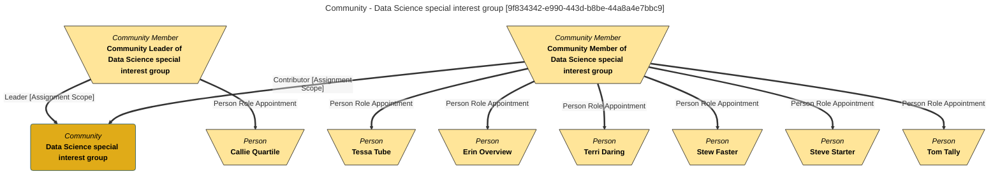

```mermaid
---
title: Community - Data Science special interest group [9f834342-e990-443d-b8be-44a8a4e7bbc9]
---
flowchart TD
%%{init: {"flowchart": {"htmlLabels": false}} }%%

1@{ shape: rounded, label: "*Community*
**Data Science special interest group**"}
2@{ shape: trap-t, label: "*Community Member*
**Community Leader of Data Science special interest group**"}
2==>|"Leader [Assignment Scope]"|1
3@{ shape: trap-t, label: "*Person*
**Callie Quartile**"}
2==>|"Person Role Appointment"|3
4@{ shape: trap-t, label: "*Community Member*
**Community Member of Data Science special interest group**"}
4==>|"Contributor [Assignment Scope]"|1
5@{ shape: trap-t, label: "*Person*
**Tessa Tube**"}
4==>|"Person Role Appointment"|5
6@{ shape: trap-t, label: "*Person*
**Erin Overview**"}
4==>|"Person Role Appointment"|6
7@{ shape: trap-t, label: "*Person*
**Terri Daring**"}
4==>|"Person Role Appointment"|7
8@{ shape: trap-t, label: "*Person*
**Stew Faster**"}
4==>|"Person Role Appointment"|8
9@{ shape: trap-t, label: "*Person*
**Steve Starter**"}
4==>|"Person Role Appointment"|9
10@{ shape: trap-t, label: "*Person*
**Tom Tally**"}
4==>|"Person Role Appointment"|10
style 1 color:#000000, fill:#e0ab18, stroke:#004563
style 2 color:#000000, fill:#FFE599, stroke:#000000
style 3 color:#000000, fill:#FFE599, stroke:#000000
style 4 color:#000000, fill:#FFE599, stroke:#000000
style 5 color:#000000, fill:#FFE599, stroke:#000000
style 6 color:#000000, fill:#FFE599, stroke:#000000
style 7 color:#000000, fill:#FFE599, stroke:#000000
style 8 color:#000000, fill:#FFE599, stroke:#000000
style 9 color:#000000, fill:#FFE599, stroke:#000000
style 10 color:#000000, fill:#FFE599, stroke:#000000
```
