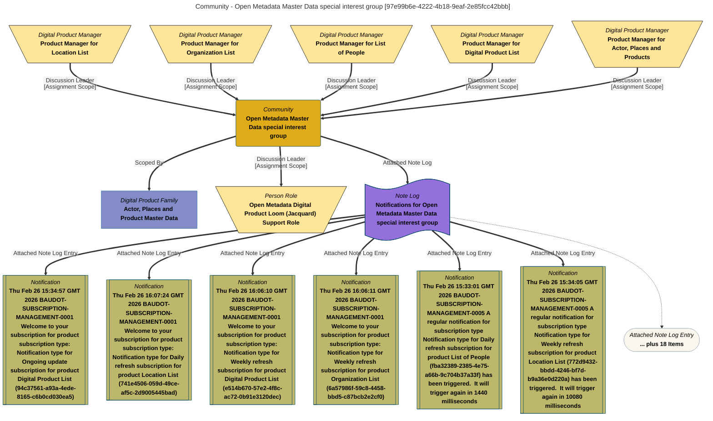

```mermaid
---
title: Community - Open Metadata Master Data special interest group [97e99b6e-4222-4b18-9eaf-2e85fcc42bbb]
---
flowchart TD
%%{init: {"flowchart": {"htmlLabels": false}} }%%

1@{ shape: rounded, label: "*Community*
**Open Metadata Master Data special interest group**"}
2@{ shape: rect, label: "*Digital Product Family*
**Actor, Places and Product Master Data**"}
1==>|"Scoped By"|2
3@{ shape: trap-t, label: "*Person Role*
**Open Metadata Digital Product Loom (Jacquard) Support Role**"}
1==>|"Discussion Leader [Assignment Scope]"|3
4@{ shape: trap-t, label: "*Digital Product Manager*
**Product Manager for Location List**"}
4==>|"Discussion Leader [Assignment Scope]"|1
5@{ shape: trap-t, label: "*Digital Product Manager*
**Product Manager for Organization List**"}
5==>|"Discussion Leader [Assignment Scope]"|1
6@{ shape: trap-t, label: "*Digital Product Manager*
**Product Manager for List of People**"}
6==>|"Discussion Leader [Assignment Scope]"|1
7@{ shape: trap-t, label: "*Digital Product Manager*
**Product Manager for Digital Product List**"}
7==>|"Discussion Leader [Assignment Scope]"|1
8@{ shape: trap-t, label: "*Digital Product Manager*
**Product Manager for Actor, Places and Products**"}
8==>|"Discussion Leader [Assignment Scope]"|1
9@{ shape: flag, label: "*Note Log*
**Notifications for Open Metadata Master Data special interest group**"}
1==>|"Attached Note Log"|9
10@{ shape: subproc, label: "*Notification*
**Thu Feb 26 15:34:57 GMT 2026 BAUDOT-SUBSCRIPTION-MANAGEMENT-0001 Welcome to your subscription for product subscription type: Notification type for Ongoing update subscription for product Digital Product List (94c37561-a93a-4ede-8165-c6b0cd030ea5)**"}
9==>|"Attached Note Log Entry"|10
11@{ shape: subproc, label: "*Notification*
**Thu Feb 26 16:07:24 GMT 2026 BAUDOT-SUBSCRIPTION-MANAGEMENT-0001 Welcome to your subscription for product subscription type: Notification type for Daily refresh subscription for product Location List (741e4506-059d-49ce-af5c-2d9005445bad)**"}
9==>|"Attached Note Log Entry"|11
12@{ shape: subproc, label: "*Notification*
**Thu Feb 26 16:06:10 GMT 2026 BAUDOT-SUBSCRIPTION-MANAGEMENT-0001 Welcome to your subscription for product subscription type: Notification type for Weekly refresh subscription for product Digital Product List (e514b670-57e2-4f8c-ac72-0b91e3120dec)**"}
9==>|"Attached Note Log Entry"|12
13@{ shape: subproc, label: "*Notification*
**Thu Feb 26 16:06:11 GMT 2026 BAUDOT-SUBSCRIPTION-MANAGEMENT-0001 Welcome to your subscription for product subscription type: Notification type for Weekly refresh subscription for product Organization List (6a57986f-59c8-4458-bbd5-c87bcb2e2cf0)**"}
9==>|"Attached Note Log Entry"|13
14@{ shape: subproc, label: "*Notification*
**Thu Feb 26 15:33:01 GMT 2026 BAUDOT-SUBSCRIPTION-MANAGEMENT-0005 A regular notification for subscription type Notification type for Daily refresh subscription for product List of People (fba32389-2385-4e75-a66b-9c704b37a33f) has been triggered.  It will trigger again in 1440 milliseconds**"}
9==>|"Attached Note Log Entry"|14
15@{ shape: subproc, label: "*Notification*
**Thu Feb 26 15:34:05 GMT 2026 BAUDOT-SUBSCRIPTION-MANAGEMENT-0005 A regular notification for subscription type Notification type for Weekly refresh subscription for product Location List (772d9432-bbdd-4246-bf7d-b9a36e0d220a) has been triggered.  It will trigger again in 10080 milliseconds**"}
9==>|"Attached Note Log Entry"|15
16@{ shape: stadium, label: "*Attached Note Log Entry*
**... plus 18 Items**"}
9-.->16
style 11 color:#000000, fill:#BDB76B, stroke:#004563
style 12 color:#000000, fill:#BDB76B, stroke:#004563
style 13 color:#000000, fill:#BDB76B, stroke:#004563
style 14 color:#000000, fill:#BDB76B, stroke:#004563
style 15 color:#000000, fill:#BDB76B, stroke:#004563
style 16 color:#000000, fill:#F9F7ED, stroke:#b7c0c7
style 1 color:#000000, fill:#e0ab18, stroke:#004563
style 2 color:#000000, fill:#838cc7, stroke:#3079ab
style 3 color:#000000, fill:#FFE599, stroke:#000000
style 4 color:#000000, fill:#FFE599, stroke:#000000
style 5 color:#000000, fill:#FFE599, stroke:#000000
style 6 color:#000000, fill:#FFE599, stroke:#000000
style 7 color:#000000, fill:#FFE599, stroke:#000000
style 8 color:#000000, fill:#FFE599, stroke:#000000
style 9 color:#000000, fill:#9370DB, stroke:#004563
style 10 color:#000000, fill:#BDB76B, stroke:#004563
```
