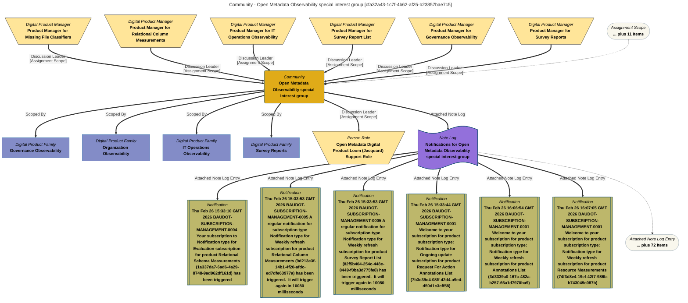

```mermaid
---
title: Community - Open Metadata Observability special interest group [cfa32a43-1c7f-4b62-af25-b23857bae7c5]
---
flowchart TD
%%{init: {"flowchart": {"htmlLabels": false}} }%%

1@{ shape: rounded, label: "*Community*
**Open Metadata Observability special interest group**"}
2@{ shape: rect, label: "*Digital Product Family*
**Governance Observability**"}
1==>|"Scoped By"|2
3@{ shape: rect, label: "*Digital Product Family*
**Organization Observability**"}
1==>|"Scoped By"|3
4@{ shape: rect, label: "*Digital Product Family*
**IT Operations Observability**"}
1==>|"Scoped By"|4
5@{ shape: rect, label: "*Digital Product Family*
**Survey Reports**"}
1==>|"Scoped By"|5
6@{ shape: trap-t, label: "*Person Role*
**Open Metadata Digital Product Loom (Jacquard) Support Role**"}
1==>|"Discussion Leader [Assignment Scope]"|6
7@{ shape: trap-t, label: "*Digital Product Manager*
**Product Manager for Missing File Classifiers**"}
7==>|"Discussion Leader [Assignment Scope]"|1
8@{ shape: trap-t, label: "*Digital Product Manager*
**Product Manager for Relational Column Measurements**"}
8==>|"Discussion Leader [Assignment Scope]"|1
9@{ shape: trap-t, label: "*Digital Product Manager*
**Product Manager for IT Operations Observability**"}
9==>|"Discussion Leader [Assignment Scope]"|1
10@{ shape: trap-t, label: "*Digital Product Manager*
**Product Manager for Survey Report List**"}
10==>|"Discussion Leader [Assignment Scope]"|1
11@{ shape: trap-t, label: "*Digital Product Manager*
**Product Manager for Governance Observability**"}
11==>|"Discussion Leader [Assignment Scope]"|1
12@{ shape: trap-t, label: "*Digital Product Manager*
**Product Manager for Survey Reports**"}
12==>|"Discussion Leader [Assignment Scope]"|1
13@{ shape: stadium, label: "*Assignment Scope*
**... plus 11 Items**"}
13-.->1
14@{ shape: flag, label: "*Note Log*
**Notifications for Open Metadata Observability special interest group**"}
1==>|"Attached Note Log"|14
15@{ shape: subproc, label: "*Notification*
**Thu Feb 26 15:33:10 GMT 2026 BAUDOT-SUBSCRIPTION-MANAGEMENT-0004 Your subscription to Notification type for Evaluation subscription for product Relational Schema Measurements (1a337da7-6ad6-4a29-8748-9ad962df161d) has been triggered**"}
14==>|"Attached Note Log Entry"|15
16@{ shape: subproc, label: "*Notification*
**Thu Feb 26 15:33:53 GMT 2026 BAUDOT-SUBSCRIPTION-MANAGEMENT-0005 A regular notification for subscription type Notification type for Weekly refresh subscription for product Relational Column Measurements (9d213e3f-14b1-4f20-afdc-ed7dfe63977a) has been triggered.  It will trigger again in 10080 milliseconds**"}
14==>|"Attached Note Log Entry"|16
17@{ shape: subproc, label: "*Notification*
**Thu Feb 26 15:33:53 GMT 2026 BAUDOT-SUBSCRIPTION-MANAGEMENT-0005 A regular notification for subscription type Notification type for Weekly refresh subscription for product Survey Report List (82f5b404-254c-448e-8449-f0ba3d775fe8) has been triggered.  It will trigger again in 10080 milliseconds**"}
14==>|"Attached Note Log Entry"|17
18@{ shape: subproc, label: "*Notification*
**Thu Feb 26 15:33:44 GMT 2026 BAUDOT-SUBSCRIPTION-MANAGEMENT-0001 Welcome to your subscription for product subscription type: Notification type for Ongoing update subscription for product Request For Action Annotations List (7b3c39c4-08ff-42d4-a9e4-d50d1c3cff58)**"}
14==>|"Attached Note Log Entry"|18
19@{ shape: subproc, label: "*Notification*
**Thu Feb 26 16:06:54 GMT 2026 BAUDOT-SUBSCRIPTION-MANAGEMENT-0001 Welcome to your subscription for product subscription type: Notification type for Weekly refresh subscription for product Annotations List (3d3339a0-167c-482a-b257-66a1d7970ba9)**"}
14==>|"Attached Note Log Entry"|19
20@{ shape: subproc, label: "*Notification*
**Thu Feb 26 16:07:05 GMT 2026 BAUDOT-SUBSCRIPTION-MANAGEMENT-0001 Welcome to your subscription for product subscription type: Notification type for Weekly refresh subscription for product Resource Measurements (74f3d8e4-19ef-42f7-986b-b743049c087b)**"}
14==>|"Attached Note Log Entry"|20
21@{ shape: stadium, label: "*Attached Note Log Entry*
**... plus 72 Items**"}
14-.->21
style 11 color:#000000, fill:#FFE599, stroke:#000000
style 12 color:#000000, fill:#FFE599, stroke:#000000
style 13 color:#000000, fill:#F9F7ED, stroke:#b7c0c7
style 14 color:#000000, fill:#9370DB, stroke:#004563
style 15 color:#000000, fill:#BDB76B, stroke:#004563
style 16 color:#000000, fill:#BDB76B, stroke:#004563
style 17 color:#000000, fill:#BDB76B, stroke:#004563
style 18 color:#000000, fill:#BDB76B, stroke:#004563
style 19 color:#000000, fill:#BDB76B, stroke:#004563
style 1 color:#000000, fill:#e0ab18, stroke:#004563
style 2 color:#000000, fill:#838cc7, stroke:#3079ab
style 3 color:#000000, fill:#838cc7, stroke:#3079ab
style 4 color:#000000, fill:#838cc7, stroke:#3079ab
style 5 color:#000000, fill:#838cc7, stroke:#3079ab
style 6 color:#000000, fill:#FFE599, stroke:#000000
style 7 color:#000000, fill:#FFE599, stroke:#000000
style 8 color:#000000, fill:#FFE599, stroke:#000000
style 9 color:#000000, fill:#FFE599, stroke:#000000
style 20 color:#000000, fill:#BDB76B, stroke:#004563
style 10 color:#000000, fill:#FFE599, stroke:#000000
style 21 color:#000000, fill:#F9F7ED, stroke:#b7c0c7
```
