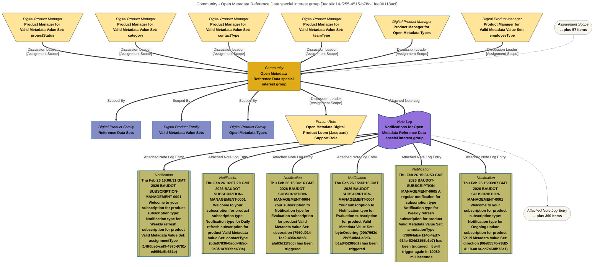

```mermaid
---
title: Community - Open Metadata Reference Data special interest group [3ada0d14-f255-4515-b78c-1fee00118acf]
---
flowchart TD
%%{init: {"flowchart": {"htmlLabels": false}} }%%

1@{ shape: rounded, label: "*Community*
**Open Metadata Reference Data special interest group**"}
2@{ shape: rect, label: "*Digital Product Family*
**Reference Data Sets**"}
1==>|"Scoped By"|2
3@{ shape: rect, label: "*Digital Product Family*
**Valid Metadata Value Sets**"}
1==>|"Scoped By"|3
4@{ shape: rect, label: "*Digital Product Family*
**Open Metadata Types**"}
1==>|"Scoped By"|4
5@{ shape: trap-t, label: "*Person Role*
**Open Metadata Digital Product Loom (Jacquard) Support Role**"}
1==>|"Discussion Leader [Assignment Scope]"|5
6@{ shape: trap-t, label: "*Digital Product Manager*
**Product Manager for Valid Metadata Value Set: projectStatus**"}
6==>|"Discussion Leader [Assignment Scope]"|1
7@{ shape: trap-t, label: "*Digital Product Manager*
**Product Manager for Valid Metadata Value Set: category**"}
7==>|"Discussion Leader [Assignment Scope]"|1
8@{ shape: trap-t, label: "*Digital Product Manager*
**Product Manager for Valid Metadata Value Set: contactType**"}
8==>|"Discussion Leader [Assignment Scope]"|1
9@{ shape: trap-t, label: "*Digital Product Manager*
**Product Manager for Valid Metadata Value Set: teamType**"}
9==>|"Discussion Leader [Assignment Scope]"|1
10@{ shape: trap-t, label: "*Digital Product Manager*
**Product Manager for Open Metadata Types**"}
10==>|"Discussion Leader [Assignment Scope]"|1
11@{ shape: trap-t, label: "*Digital Product Manager*
**Product Manager for Valid Metadata Value Set: employeeType**"}
11==>|"Discussion Leader [Assignment Scope]"|1
12@{ shape: stadium, label: "*Assignment Scope*
**... plus 57 Items**"}
12-.->1
13@{ shape: flag, label: "*Note Log*
**Notifications for Open Metadata Reference Data special interest group**"}
1==>|"Attached Note Log"|13
14@{ shape: subproc, label: "*Notification*
**Thu Feb 26 16:06:31 GMT 2026 BAUDOT-SUBSCRIPTION-MANAGEMENT-0001 Welcome to your subscription for product subscription type: Notification type for Weekly refresh subscription for product Valid Metadata Value Set: assignmentType (14ff6be5-cef9-4970-9781-ed959a5b631e)**"}
13==>|"Attached Note Log Entry"|14
15@{ shape: subproc, label: "*Notification*
**Thu Feb 26 16:07:20 GMT 2026 BAUDOT-SUBSCRIPTION-MANAGEMENT-0001 Welcome to your subscription for product subscription type: Notification type for Daily refresh subscription for product Valid Metadata Value Set: contactType (bde97836-0acd-4b5c-9a3f-1a766fec438a)**"}
13==>|"Attached Note Log Entry"|15
16@{ shape: subproc, label: "*Notification*
**Thu Feb 26 15:34:16 GMT 2026 BAUDOT-SUBSCRIPTION-MANAGEMENT-0004 Your subscription to Notification type for Evaluation subscription for product Valid Metadata Value Set: decoration (7960d014-1ee2-405a-9db8-afa63d11f9c0) has been triggered**"}
13==>|"Attached Note Log Entry"|16
17@{ shape: subproc, label: "*Notification*
**Thu Feb 26 15:33:16 GMT 2026 BAUDOT-SUBSCRIPTION-MANAGEMENT-0004 Your subscription to Notification type for Evaluation subscription for product Valid Metadata Value Set: byteOrdering (00b7963d-2b8f-4dc4-a3d3-b1a8452f86d1) has been triggered**"}
13==>|"Attached Note Log Entry"|17
18@{ shape: subproc, label: "*Notification*
**Thu Feb 26 15:34:53 GMT 2026 BAUDOT-SUBSCRIPTION-MANAGEMENT-0005 A regular notification for subscription type Notification type for Weekly refresh subscription for product Valid Metadata Value Set: annotationType (78864aba-1140-4ad7-914e-824d2155b3e7) has been triggered.  It will trigger again in 10080 milliseconds**"}
13==>|"Attached Note Log Entry"|18
19@{ shape: subproc, label: "*Notification*
**Thu Feb 26 15:33:07 GMT 2026 BAUDOT-SUBSCRIPTION-MANAGEMENT-0001 Welcome to your subscription for product subscription type: Notification type for Ongoing update subscription for product Valid Metadata Value Set: direction (06e85570-79d2-4119-a01a-cd7a68fb73a1)**"}
13==>|"Attached Note Log Entry"|19
20@{ shape: stadium, label: "*Attached Note Log Entry*
**... plus 360 Items**"}
13-.->20
style 11 color:#000000, fill:#FFE599, stroke:#000000
style 12 color:#000000, fill:#F9F7ED, stroke:#b7c0c7
style 13 color:#000000, fill:#9370DB, stroke:#004563
style 14 color:#000000, fill:#BDB76B, stroke:#004563
style 15 color:#000000, fill:#BDB76B, stroke:#004563
style 16 color:#000000, fill:#BDB76B, stroke:#004563
style 17 color:#000000, fill:#BDB76B, stroke:#004563
style 18 color:#000000, fill:#BDB76B, stroke:#004563
style 19 color:#000000, fill:#BDB76B, stroke:#004563
style 1 color:#000000, fill:#e0ab18, stroke:#004563
style 2 color:#000000, fill:#838cc7, stroke:#3079ab
style 3 color:#000000, fill:#838cc7, stroke:#3079ab
style 4 color:#000000, fill:#838cc7, stroke:#3079ab
style 5 color:#000000, fill:#FFE599, stroke:#000000
style 6 color:#000000, fill:#FFE599, stroke:#000000
style 7 color:#000000, fill:#FFE599, stroke:#000000
style 8 color:#000000, fill:#FFE599, stroke:#000000
style 9 color:#000000, fill:#FFE599, stroke:#000000
style 20 color:#000000, fill:#F9F7ED, stroke:#b7c0c7
style 10 color:#000000, fill:#FFE599, stroke:#000000
```
