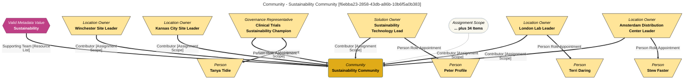

```mermaid
---
title: Community - Sustainability Community [f6ebba23-2858-43db-a86b-10b6f5a0b383]
---
flowchart TD
%%{init: {"flowchart": {"htmlLabels": false}} }%%

1@{ shape: rounded, label: "*Community*
**Sustainability Community**"}
2@{ shape: hex, label: "*Valid Metadata Value*
**Sustainability**"}
2==>|"Supporting Team [Resource List]"|1
3@{ shape: trap-t, label: "*Governance Representative*
**Clinical Trials Sustainability Champion**"}
3==>|"Contributor [Assignment Scope]"|1
4@{ shape: trap-t, label: "*Person*
**Tanya Tidie**"}
3==>|"Person Role Appointment"|4
5@{ shape: trap-t, label: "*Solution Owner*
**Sustainability Technology Lead**"}
5==>|"Contributor [Assignment Scope]"|1
6@{ shape: trap-t, label: "*Person*
**Peter Profile**"}
5==>|"Person Role Appointment"|6
7@{ shape: trap-t, label: "*Location Owner*
**Winchester Site Leader**"}
7==>|"Contributor [Assignment Scope]"|1
8@{ shape: trap-t, label: "*Location Owner*
**Kansas City Site Leader**"}
8==>|"Contributor [Assignment Scope]"|1
9@{ shape: trap-t, label: "*Location Owner*
**London Lab Leader**"}
9==>|"Contributor [Assignment Scope]"|1
10@{ shape: trap-t, label: "*Person*
**Terri Daring**"}
9==>|"Person Role Appointment"|10
11@{ shape: trap-t, label: "*Location Owner*
**Amsterdam Distribution Center Leader**"}
11==>|"Contributor [Assignment Scope]"|1
12@{ shape: trap-t, label: "*Person*
**Stew Faster**"}
11==>|"Person Role Appointment"|12
13@{ shape: stadium, label: "*Assignment Scope*
**... plus 34 Items**"}
13-.->1
style 11 color:#000000, fill:#FFE599, stroke:#000000
style 12 color:#000000, fill:#FFE599, stroke:#000000
style 13 color:#000000, fill:#F9F7ED, stroke:#b7c0c7
style 1 color:#000000, fill:#e0ab18, stroke:#004563
style 2 color:#FFFFFF, fill:#bf4086, stroke:#732650
style 3 color:#000000, fill:#FFE599, stroke:#000000
style 4 color:#000000, fill:#FFE599, stroke:#000000
style 5 color:#000000, fill:#FFE599, stroke:#000000
style 6 color:#000000, fill:#FFE599, stroke:#000000
style 7 color:#000000, fill:#FFE599, stroke:#000000
style 8 color:#000000, fill:#FFE599, stroke:#000000
style 9 color:#000000, fill:#FFE599, stroke:#000000
style 10 color:#000000, fill:#FFE599, stroke:#000000
```
