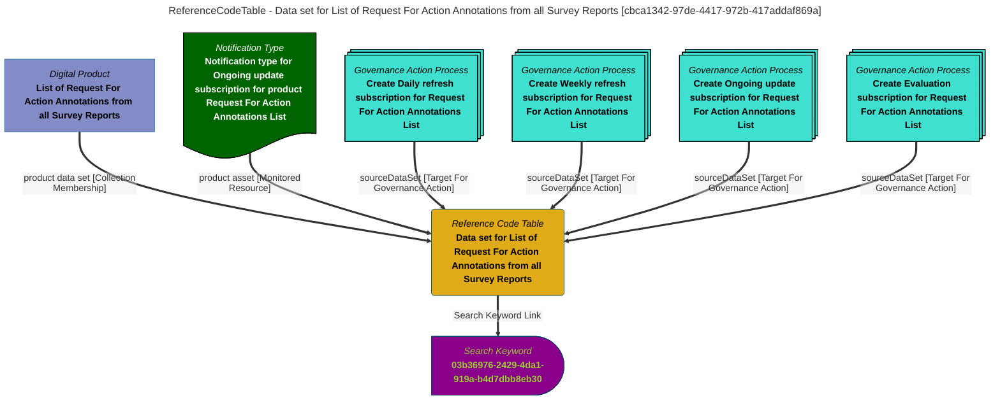

```mermaid
---
title: ReferenceCodeTable - Data set for List of Request For Action Annotations from all Survey Reports [cbca1342-97de-4417-972b-417addaf869a]
---
flowchart TD
%%{init: {"flowchart": {"htmlLabels": false}} }%%

1@{ shape: rounded, label: "*Reference Code Table*
**Data set for List of Request For Action Annotations from all Survey Reports**"}
2@{ shape: delay, label: "*Search Keyword*
**03b36976-2429-4da1-919a-b4d7dbb8eb30**"}
1==>|"Search Keyword Link"|2
3@{ shape: rect, label: "*Digital Product*
**List of Request For Action Annotations from all Survey Reports**"}
3==>|"product data set [Collection Membership]"|1
4@{ shape: doc, label: "*Notification Type*
**Notification type for Ongoing update subscription for product Request For Action Annotations List**"}
4==>|"product asset [Monitored Resource]"|1
5@{ shape: processes, label: "*Governance Action Process*
**Create Daily refresh subscription for Request For Action Annotations List**"}
5==>|"sourceDataSet [Target For Governance Action]"|1
6@{ shape: processes, label: "*Governance Action Process*
**Create Weekly refresh subscription for Request For Action Annotations List**"}
6==>|"sourceDataSet [Target For Governance Action]"|1
7@{ shape: processes, label: "*Governance Action Process*
**Create Ongoing update subscription for Request For Action Annotations List**"}
7==>|"sourceDataSet [Target For Governance Action]"|1
8@{ shape: processes, label: "*Governance Action Process*
**Create Evaluation subscription for Request For Action Annotations List**"}
8==>|"sourceDataSet [Target For Governance Action]"|1
style 1 color:#000000, fill:#e0ab18, stroke:#004563
style 2 color:#9ACD32, fill:#8B008B, stroke:#004563
style 3 color:#000000, fill:#838cc7, stroke:#3079ab
style 4 color:#FFFFFF, fill:#006400, stroke:#000000
style 5 color:#000000, fill:#40E0D0, stroke:#000000
style 6 color:#000000, fill:#40E0D0, stroke:#000000
style 7 color:#000000, fill:#40E0D0, stroke:#000000
style 8 color:#000000, fill:#40E0D0, stroke:#000000
```
> Data set for List of Request For Action Annotations from all Survey Reports: This asset represents the source of data for the digital product. (Extracted from 6.0-SNAPSHOT)
