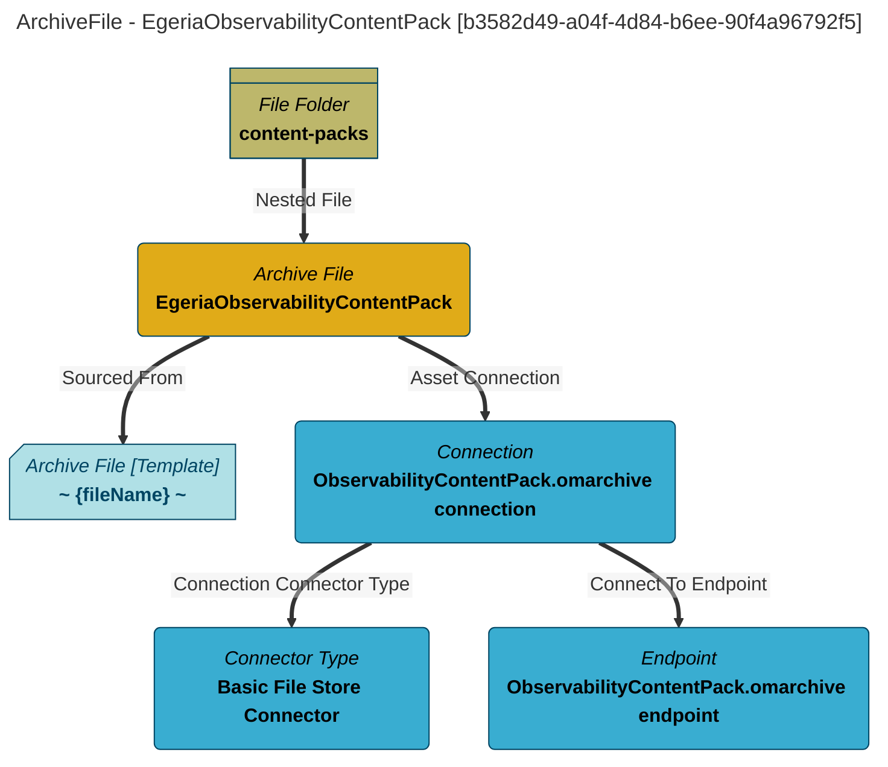

```mermaid
---
title: ArchiveFile - EgeriaObservabilityContentPack [b3582d49-a04f-4d84-b6ee-90f4a96792f5]
---
flowchart TD
%%{init: {"flowchart": {"htmlLabels": false}} }%%

1@{ shape: rounded, label: "*Archive File*
**EgeriaObservabilityContentPack**"}
2@{ shape: card, label: "*Archive File [Template]*
**~ {fileName} ~**"}
1==>|"Sourced From"|2
3@{ shape: rounded, label: "*Connection*
**ObservabilityContentPack.omarchive connection**"}
1==>|"Asset Connection"|3
4@{ shape: rounded, label: "*Connector Type*
**Basic File Store Connector**"}
3==>|"Connection Connector Type"|4
5@{ shape: rounded, label: "*Endpoint*
**ObservabilityContentPack.omarchive endpoint**"}
3==>|"Connect To Endpoint"|5
6@{ shape: div-rect, label: "*File Folder*
**content-packs**"}
6==>|"Nested File"|1
style 1 color:#000000, fill:#e0ab18, stroke:#004563
style 2 color:#004563, fill:#b0e0e6, stroke:#004563
style 3 color:#000000, fill:#39add1, stroke:#004563
style 4 color:#000000, fill:#39add1, stroke:#004563
style 5 color:#000000, fill:#39add1, stroke:#004563
style 6 color:#000000, fill:#bdb76b, stroke:#004563
```
