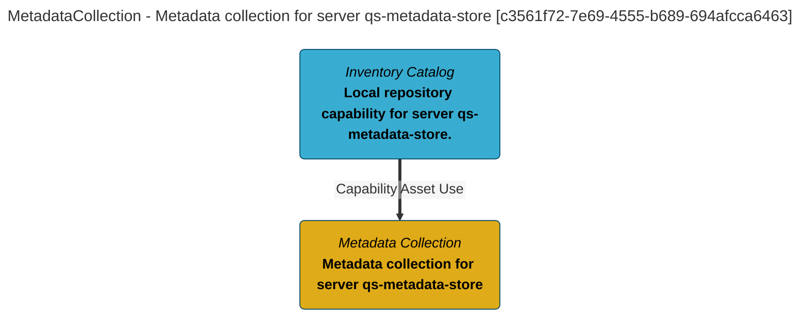

```mermaid
---
title: MetadataCollection - Metadata collection for server qs-metadata-store [c3561f72-7e69-4555-b689-694afcca6463]
---
flowchart TD
%%{init: {"flowchart": {"htmlLabels": false}} }%%

1@{ shape: rounded, label: "*Metadata Collection*
**Metadata collection for server qs-metadata-store**"}
2@{ shape: rounded, label: "*Inventory Catalog*
**Local repository capability for server qs-metadata-store.**"}
2==>|"Capability Asset Use"|1
style 1 color:#000000, fill:#e0ab18, stroke:#004563
style 2 color:#000000, fill:#39add1, stroke:#004563
```
