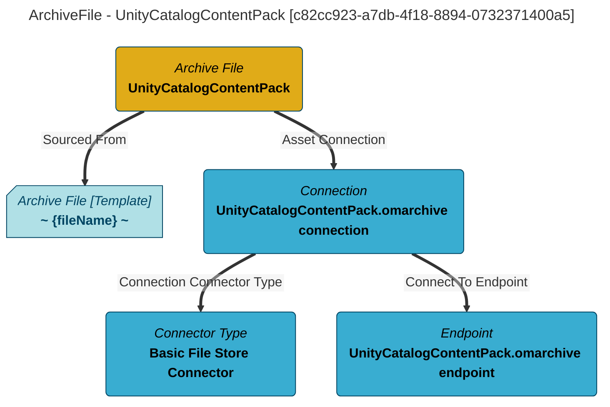

```mermaid
---
title: ArchiveFile - UnityCatalogContentPack [c82cc923-a7db-4f18-8894-0732371400a5]
---
flowchart TD
%%{init: {"flowchart": {"htmlLabels": false}} }%%

1@{ shape: rounded, label: "*Archive File*
**UnityCatalogContentPack**"}
2@{ shape: card, label: "*Archive File [Template]*
**~ {fileName} ~**"}
1==>|"Sourced From"|2
3@{ shape: rounded, label: "*Connection*
**UnityCatalogContentPack.omarchive connection**"}
1==>|"Asset Connection"|3
4@{ shape: rounded, label: "*Connector Type*
**Basic File Store Connector**"}
3==>|"Connection Connector Type"|4
5@{ shape: rounded, label: "*Endpoint*
**UnityCatalogContentPack.omarchive endpoint**"}
3==>|"Connect To Endpoint"|5
style 1 color:#000000, fill:#e0ab18, stroke:#004563
style 2 color:#004563, fill:#b0e0e6, stroke:#004563
style 3 color:#000000, fill:#39add1, stroke:#004563
style 4 color:#000000, fill:#39add1, stroke:#004563
style 5 color:#000000, fill:#39add1, stroke:#004563
```
