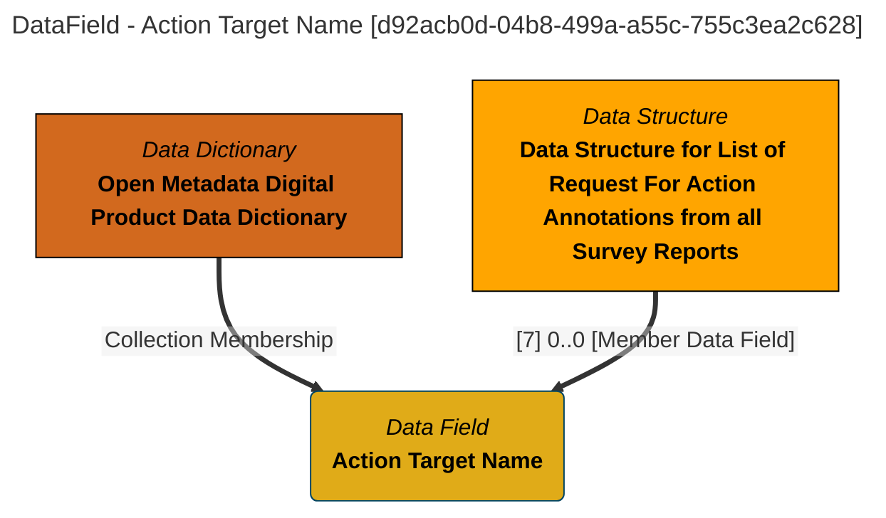

```mermaid
---
title: DataField - Action Target Name [d92acb0d-04b8-499a-a55c-755c3ea2c628]
---
flowchart TD
%%{init: {"flowchart": {"htmlLabels": false}} }%%

1@{ shape: rounded, label: "*Data Field*
**Action Target Name**"}
2@{ shape: rect, label: "*Data Dictionary*
**Open Metadata Digital Product Data Dictionary**"}
2==>|"Collection Membership"|1
3@{ shape: rect, label: "*Data Structure*
**Data Structure for List of Request For Action Annotations from all Survey Reports**"}
3==>|"[7] 0..0 [Member Data Field]"|1
style 1 color:#000000, fill:#e0ab18, stroke:#004563
style 2 color:#000000, fill:#d2691e, stroke:#000000
style 3 color:#000000, fill:#FFA500, stroke:#000000
```
