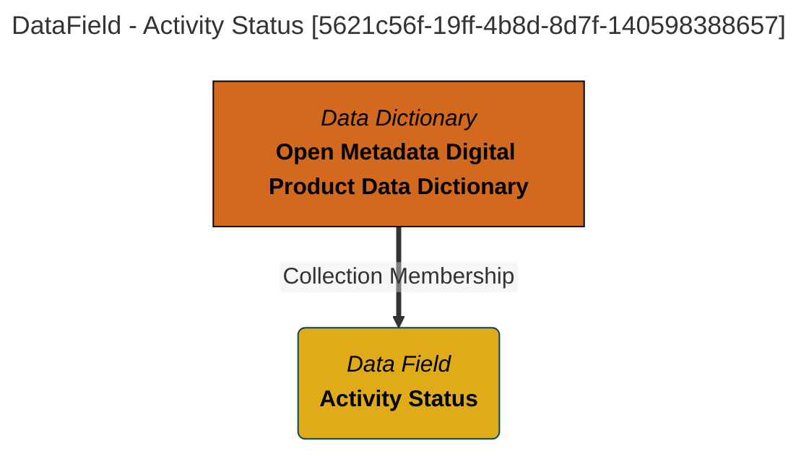

```mermaid
---
title: DataField - Activity Status [5621c56f-19ff-4b8d-8d7f-140598388657]
---
flowchart TD
%%{init: {"flowchart": {"htmlLabels": false}} }%%

1@{ shape: rounded, label: "*Data Field*
**Activity Status**"}
2@{ shape: rect, label: "*Data Dictionary*
**Open Metadata Digital Product Data Dictionary**"}
2==>|"Collection Membership"|1
style 1 color:#000000, fill:#e0ab18, stroke:#004563
style 2 color:#000000, fill:#d2691e, stroke:#000000
```
