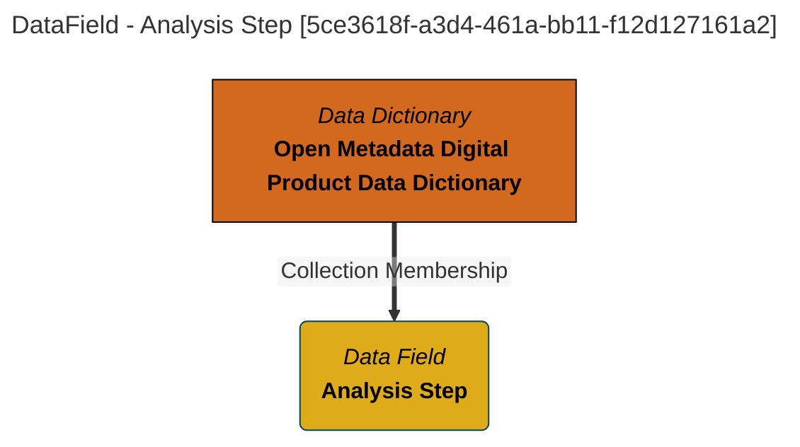

```mermaid
---
title: DataField - Analysis Step [5ce3618f-a3d4-461a-bb11-f12d127161a2]
---
flowchart TD
%%{init: {"flowchart": {"htmlLabels": false}} }%%

1@{ shape: rounded, label: "*Data Field*
**Analysis Step**"}
2@{ shape: rect, label: "*Data Dictionary*
**Open Metadata Digital Product Data Dictionary**"}
2==>|"Collection Membership"|1
style 1 color:#000000, fill:#e0ab18, stroke:#004563
style 2 color:#000000, fill:#d2691e, stroke:#000000
```
