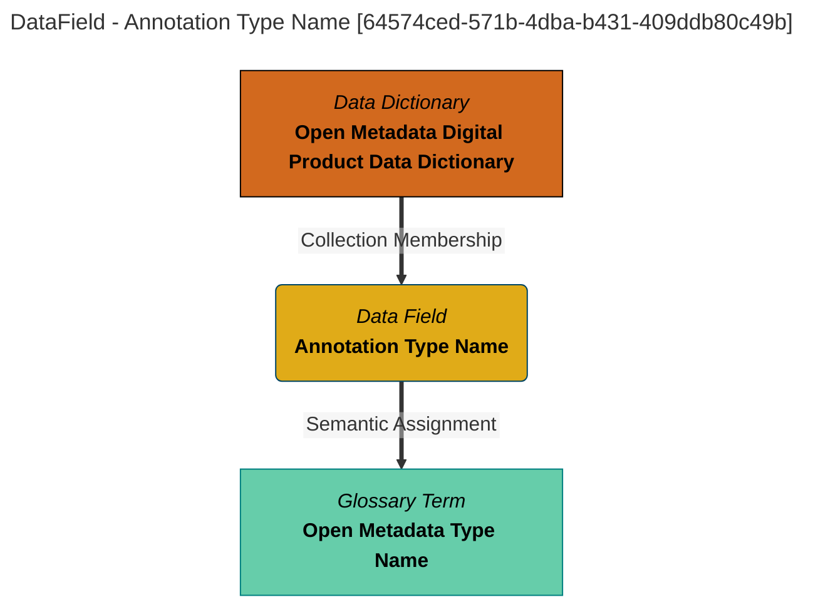

```mermaid
---
title: DataField - Annotation Type Name [64574ced-571b-4dba-b431-409ddb80c49b]
---
flowchart TD
%%{init: {"flowchart": {"htmlLabels": false}} }%%

1@{ shape: rounded, label: "*Data Field*
**Annotation Type Name**"}
2@{ shape: rect, label: "*Data Dictionary*
**Open Metadata Digital Product Data Dictionary**"}
2==>|"Collection Membership"|1
3@{ shape: rect, label: "*Glossary Term*
**Open Metadata Type Name**"}
1==>|"Semantic Assignment"|3
style 1 color:#000000, fill:#e0ab18, stroke:#004563
style 2 color:#000000, fill:#d2691e, stroke:#000000
style 3 color:#000000, fill:#66CDAA, stroke:#008080
```
