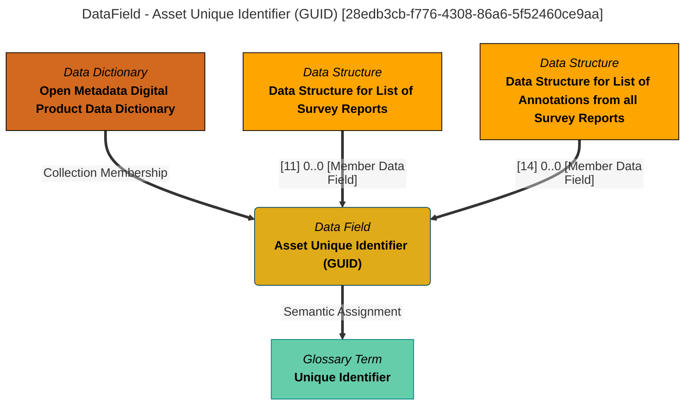

```mermaid
---
title: DataField - Asset Unique Identifier (GUID) [28edb3cb-f776-4308-86a6-5f52460ce9aa]
---
flowchart TD
%%{init: {"flowchart": {"htmlLabels": false}} }%%

1@{ shape: rounded, label: "*Data Field*
**Asset Unique Identifier (GUID)**"}
2@{ shape: rect, label: "*Data Dictionary*
**Open Metadata Digital Product Data Dictionary**"}
2==>|"Collection Membership"|1
3@{ shape: rect, label: "*Glossary Term*
**Unique Identifier**"}
1==>|"Semantic Assignment"|3
4@{ shape: rect, label: "*Data Structure*
**Data Structure for List of Survey Reports**"}
4==>|"[11] 0..0 [Member Data Field]"|1
5@{ shape: rect, label: "*Data Structure*
**Data Structure for List of Annotations from all Survey Reports**"}
5==>|"[14] 0..0 [Member Data Field]"|1
style 1 color:#000000, fill:#e0ab18, stroke:#004563
style 2 color:#000000, fill:#d2691e, stroke:#000000
style 3 color:#000000, fill:#66CDAA, stroke:#008080
style 4 color:#000000, fill:#FFA500, stroke:#000000
style 5 color:#000000, fill:#FFA500, stroke:#000000
```
