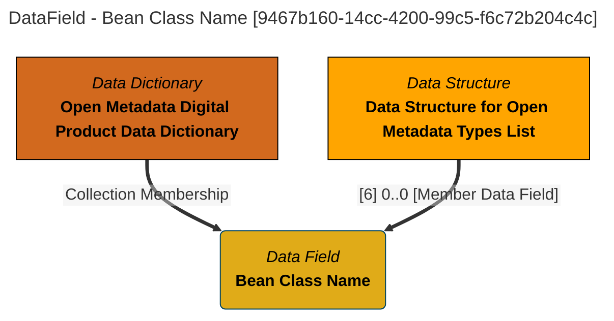

```mermaid
---
title: DataField - Bean Class Name [9467b160-14cc-4200-99c5-f6c72b204c4c]
---
flowchart TD
%%{init: {"flowchart": {"htmlLabels": false}} }%%

1@{ shape: rounded, label: "*Data Field*
**Bean Class Name**"}
2@{ shape: rect, label: "*Data Dictionary*
**Open Metadata Digital Product Data Dictionary**"}
2==>|"Collection Membership"|1
3@{ shape: rect, label: "*Data Structure*
**Data Structure for Open Metadata Types List**"}
3==>|"[6] 0..0 [Member Data Field]"|1
style 1 color:#000000, fill:#e0ab18, stroke:#004563
style 2 color:#000000, fill:#d2691e, stroke:#000000
style 3 color:#000000, fill:#FFA500, stroke:#000000
```
