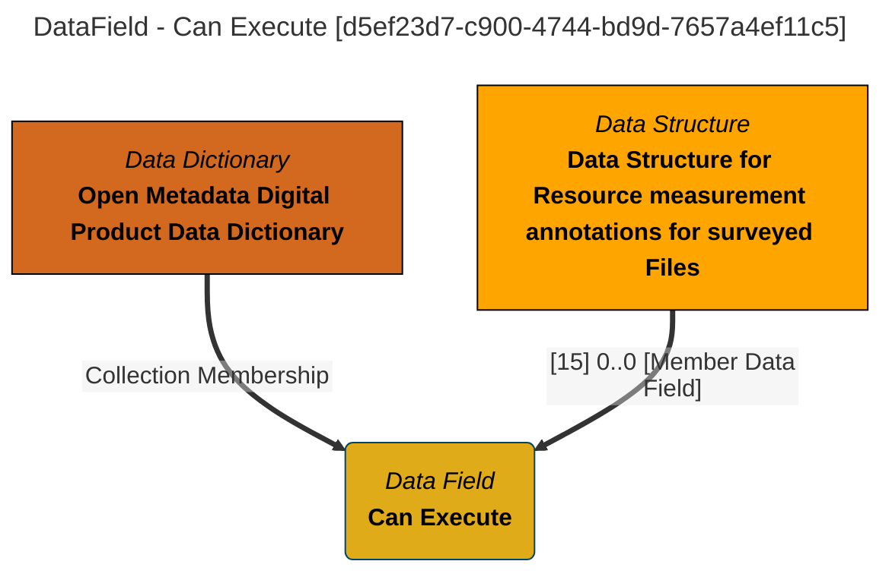

```mermaid
---
title: DataField - Can Execute [d5ef23d7-c900-4744-bd9d-7657a4ef11c5]
---
flowchart TD
%%{init: {"flowchart": {"htmlLabels": false}} }%%

1@{ shape: rounded, label: "*Data Field*
**Can Execute**"}
2@{ shape: rect, label: "*Data Dictionary*
**Open Metadata Digital Product Data Dictionary**"}
2==>|"Collection Membership"|1
3@{ shape: rect, label: "*Data Structure*
**Data Structure for Resource measurement annotations for surveyed Files**"}
3==>|"[15] 0..0 [Member Data Field]"|1
style 1 color:#000000, fill:#e0ab18, stroke:#004563
style 2 color:#000000, fill:#d2691e, stroke:#000000
style 3 color:#000000, fill:#FFA500, stroke:#000000
```
