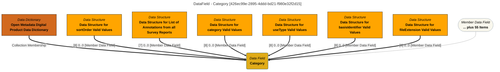

```mermaid
---
title: DataField - Category [426ec99e-2895-4ddd-bd21-f980e32f2d15]
---
flowchart TD
%%{init: {"flowchart": {"htmlLabels": false}} }%%

1@{ shape: rounded, label: "*Data Field*
**Category**"}
2@{ shape: rect, label: "*Data Dictionary*
**Open Metadata Digital Product Data Dictionary**"}
2==>|"Collection Membership"|1
3@{ shape: rect, label: "*Data Structure*
**Data Structure for sortOrder Valid Values**"}
3==>|"[8] 0..0 [Member Data Field]"|1
4@{ shape: rect, label: "*Data Structure*
**Data Structure for List of Annotations from all Survey Reports**"}
4==>|"[7] 0..0 [Member Data Field]"|1
5@{ shape: rect, label: "*Data Structure*
**Data Structure for category Valid Values**"}
5==>|"[8] 0..0 [Member Data Field]"|1
6@{ shape: rect, label: "*Data Structure*
**Data Structure for useType Valid Values**"}
6==>|"[8] 0..0 [Member Data Field]"|1
7@{ shape: rect, label: "*Data Structure*
**Data Structure for basisIdentifier Valid Values**"}
7==>|"[8] 0..0 [Member Data Field]"|1
8@{ shape: rect, label: "*Data Structure*
**Data Structure for fileExtension Valid Values**"}
8==>|"[8] 0..0 [Member Data Field]"|1
9@{ shape: stadium, label: "*Member Data Field*
**... plus 55 Items**"}
9-.->1
style 1 color:#000000, fill:#e0ab18, stroke:#004563
style 2 color:#000000, fill:#d2691e, stroke:#000000
style 3 color:#000000, fill:#FFA500, stroke:#000000
style 4 color:#000000, fill:#FFA500, stroke:#000000
style 5 color:#000000, fill:#FFA500, stroke:#000000
style 6 color:#000000, fill:#FFA500, stroke:#000000
style 7 color:#000000, fill:#FFA500, stroke:#000000
style 8 color:#000000, fill:#FFA500, stroke:#000000
style 9 color:#000000, fill:#F9F7ED, stroke:#b7c0c7
```
