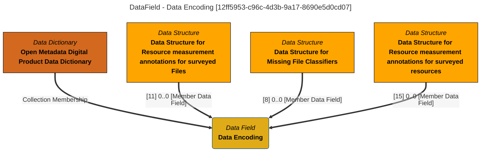

```mermaid
---
title: DataField - Data Encoding [12ff5953-c96c-4d3b-9a17-8690e5d0cd07]
---
flowchart TD
%%{init: {"flowchart": {"htmlLabels": false}} }%%

1@{ shape: rounded, label: "*Data Field*
**Data Encoding**"}
2@{ shape: rect, label: "*Data Dictionary*
**Open Metadata Digital Product Data Dictionary**"}
2==>|"Collection Membership"|1
3@{ shape: rect, label: "*Data Structure*
**Data Structure for Resource measurement annotations for surveyed Files**"}
3==>|"[11] 0..0 [Member Data Field]"|1
4@{ shape: rect, label: "*Data Structure*
**Data Structure for Missing File Classifiers**"}
4==>|"[8] 0..0 [Member Data Field]"|1
5@{ shape: rect, label: "*Data Structure*
**Data Structure for Resource measurement annotations for surveyed resources**"}
5==>|"[15] 0..0 [Member Data Field]"|1
style 1 color:#000000, fill:#e0ab18, stroke:#004563
style 2 color:#000000, fill:#d2691e, stroke:#000000
style 3 color:#000000, fill:#FFA500, stroke:#000000
style 4 color:#000000, fill:#FFA500, stroke:#000000
style 5 color:#000000, fill:#FFA500, stroke:#000000
```
