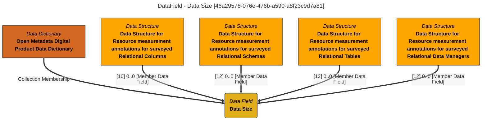

```mermaid
---
title: DataField - Data Size [46a29578-076e-476b-a590-a8f23c9d7a81]
---
flowchart TD
%%{init: {"flowchart": {"htmlLabels": false}} }%%

1@{ shape: rounded, label: "*Data Field*
**Data Size**"}
2@{ shape: rect, label: "*Data Dictionary*
**Open Metadata Digital Product Data Dictionary**"}
2==>|"Collection Membership"|1
3@{ shape: rect, label: "*Data Structure*
**Data Structure for Resource measurement annotations for surveyed Relational Columns**"}
3==>|"[10] 0..0 [Member Data Field]"|1
4@{ shape: rect, label: "*Data Structure*
**Data Structure for Resource measurement annotations for surveyed Relational Schemas**"}
4==>|"[12] 0..0 [Member Data Field]"|1
5@{ shape: rect, label: "*Data Structure*
**Data Structure for Resource measurement annotations for surveyed Relational Tables**"}
5==>|"[12] 0..0 [Member Data Field]"|1
6@{ shape: rect, label: "*Data Structure*
**Data Structure for Resource measurement annotations for surveyed Relational Data Managers**"}
6==>|"[12] 0..0 [Member Data Field]"|1
style 1 color:#000000, fill:#e0ab18, stroke:#004563
style 2 color:#000000, fill:#d2691e, stroke:#000000
style 3 color:#000000, fill:#FFA500, stroke:#000000
style 4 color:#000000, fill:#FFA500, stroke:#000000
style 5 color:#000000, fill:#FFA500, stroke:#000000
style 6 color:#000000, fill:#FFA500, stroke:#000000
```
