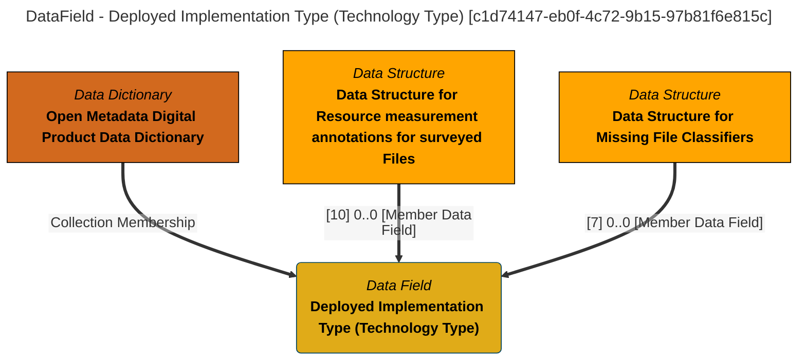

```mermaid
---
title: DataField - Deployed Implementation Type (Technology Type) [c1d74147-eb0f-4c72-9b15-97b81f6e815c]
---
flowchart TD
%%{init: {"flowchart": {"htmlLabels": false}} }%%

1@{ shape: rounded, label: "*Data Field*
**Deployed Implementation Type (Technology Type)**"}
2@{ shape: rect, label: "*Data Dictionary*
**Open Metadata Digital Product Data Dictionary**"}
2==>|"Collection Membership"|1
3@{ shape: rect, label: "*Data Structure*
**Data Structure for Resource measurement annotations for surveyed Files**"}
3==>|"[10] 0..0 [Member Data Field]"|1
4@{ shape: rect, label: "*Data Structure*
**Data Structure for Missing File Classifiers**"}
4==>|"[7] 0..0 [Member Data Field]"|1
style 1 color:#000000, fill:#e0ab18, stroke:#004563
style 2 color:#000000, fill:#d2691e, stroke:#000000
style 3 color:#000000, fill:#FFA500, stroke:#000000
style 4 color:#000000, fill:#FFA500, stroke:#000000
```
