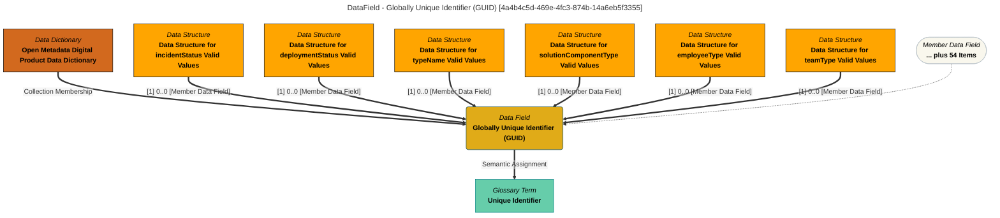

```mermaid
---
title: DataField - Globally Unique Identifier (GUID) [4a4b4c5d-469e-4fc3-874b-14a6eb5f3355]
---
flowchart TD
%%{init: {"flowchart": {"htmlLabels": false}} }%%

1@{ shape: rounded, label: "*Data Field*
**Globally Unique Identifier (GUID)**"}
2@{ shape: rect, label: "*Data Dictionary*
**Open Metadata Digital Product Data Dictionary**"}
2==>|"Collection Membership"|1
3@{ shape: rect, label: "*Glossary Term*
**Unique Identifier**"}
1==>|"Semantic Assignment"|3
4@{ shape: rect, label: "*Data Structure*
**Data Structure for incidentStatus Valid Values**"}
4==>|"[1] 0..0 [Member Data Field]"|1
5@{ shape: rect, label: "*Data Structure*
**Data Structure for deploymentStatus Valid Values**"}
5==>|"[1] 0..0 [Member Data Field]"|1
6@{ shape: rect, label: "*Data Structure*
**Data Structure for typeName Valid Values**"}
6==>|"[1] 0..0 [Member Data Field]"|1
7@{ shape: rect, label: "*Data Structure*
**Data Structure for solutionComponentType Valid Values**"}
7==>|"[1] 0..0 [Member Data Field]"|1
8@{ shape: rect, label: "*Data Structure*
**Data Structure for employeeType Valid Values**"}
8==>|"[1] 0..0 [Member Data Field]"|1
9@{ shape: rect, label: "*Data Structure*
**Data Structure for teamType Valid Values**"}
9==>|"[1] 0..0 [Member Data Field]"|1
10@{ shape: stadium, label: "*Member Data Field*
**... plus 54 Items**"}
10-.->1
style 1 color:#000000, fill:#e0ab18, stroke:#004563
style 2 color:#000000, fill:#d2691e, stroke:#000000
style 3 color:#000000, fill:#66CDAA, stroke:#008080
style 4 color:#000000, fill:#FFA500, stroke:#000000
style 5 color:#000000, fill:#FFA500, stroke:#000000
style 6 color:#000000, fill:#FFA500, stroke:#000000
style 7 color:#000000, fill:#FFA500, stroke:#000000
style 8 color:#000000, fill:#FFA500, stroke:#000000
style 9 color:#000000, fill:#FFA500, stroke:#000000
style 10 color:#000000, fill:#F9F7ED, stroke:#b7c0c7
```
