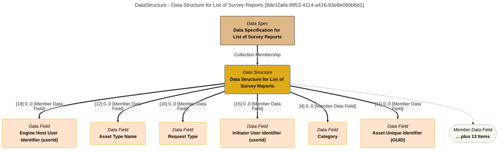

```mermaid
---
title: DataStructure - Data Structure for List of Survey Reports [8de10afa-8853-4114-a416-83e8e066b6d1]
---
flowchart TD
%%{init: {"flowchart": {"htmlLabels": false}} }%%

1@{ shape: rounded, label: "*Data Structure*
**Data Structure for List of Survey Reports**"}
2@{ shape: rect, label: "*Data Spec*
**Data Specification for List of Survey Reports**"}
2==>|"Collection Membership"|1
3@{ shape: rect, label: "*Data Field*
**Engine Host User Identifier (userId)**"}
1==>|"[18] 0..0 [Member Data Field]"|3
4@{ shape: rect, label: "*Data Field*
**Asset Type Name**"}
1==>|"[12] 0..0 [Member Data Field]"|4
5@{ shape: rect, label: "*Data Field*
**Request Type**"}
1==>|"[16] 0..0 [Member Data Field]"|5
6@{ shape: rect, label: "*Data Field*
**Initiator User Identifier (userId)**"}
1==>|"[15] 0..0 [Member Data Field]"|6
7@{ shape: rect, label: "*Data Field*
**Category**"}
1==>|"[4] 0..0 [Member Data Field]"|7
8@{ shape: rect, label: "*Data Field*
**Asset Unique Identifier (GUID)**"}
1==>|"[11] 0..0 [Member Data Field]"|8
9@{ shape: stadium, label: "*Member Data Field*
**... plus 13 Items**"}
1-.->9
style 1 color:#000000, fill:#e0ab18, stroke:#004563
style 2 color:#000000, fill:#DEB887, stroke:#000000
style 3 color:#000000, fill:#ffe3cc, stroke:#FFA500
style 4 color:#000000, fill:#ffe3cc, stroke:#FFA500
style 5 color:#000000, fill:#ffe3cc, stroke:#FFA500
style 6 color:#000000, fill:#ffe3cc, stroke:#FFA500
style 7 color:#000000, fill:#ffe3cc, stroke:#FFA500
style 8 color:#000000, fill:#ffe3cc, stroke:#FFA500
style 9 color:#000000, fill:#F9F7ED, stroke:#b7c0c7
```
> Data Structure for List of Survey Reports: The data structure lists the fields in the Survey Report List product. (Extracted from 6.0-SNAPSHOT)
