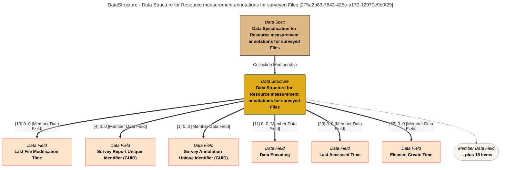

```mermaid
---
title: DataStructure - Data Structure for Resource measurement annotations for surveyed Files [275a2b83-7843-425e-a170-12970e9b0f29]
---
flowchart TD
%%{init: {"flowchart": {"htmlLabels": false}} }%%

1@{ shape: rounded, label: "*Data Structure*
**Data Structure for Resource measurement annotations for surveyed Files**"}
2@{ shape: rect, label: "*Data Spec*
**Data Specification for Resource measurement annotations for surveyed Files**"}
2==>|"Collection Membership"|1
3@{ shape: rect, label: "*Data Field*
**Last File Modification Time**"}
1==>|"[19] 0..0 [Member Data Field]"|3
4@{ shape: rect, label: "*Data Field*
**Survey Report Unique Identifier (GUID)**"}
1==>|"[4] 0..0 [Member Data Field]"|4
5@{ shape: rect, label: "*Data Field*
**Survey Annotation Unique Identifier (GUID)**"}
1==>|"[1] 0..0 [Member Data Field]"|5
6@{ shape: rect, label: "*Data Field*
**Data Encoding**"}
1==>|"[11] 0..0 [Member Data Field]"|6
7@{ shape: rect, label: "*Data Field*
**Last Accessed Time**"}
1==>|"[20] 0..0 [Member Data Field]"|7
8@{ shape: rect, label: "*Data Field*
**Element Create Time**"}
1==>|"[23] 0..0 [Member Data Field]"|8
9@{ shape: stadium, label: "*Member Data Field*
**... plus 18 Items**"}
1-.->9
style 1 color:#000000, fill:#e0ab18, stroke:#004563
style 2 color:#000000, fill:#deb887, stroke:#000000
style 3 color:#000000, fill:#ffe3cc, stroke:#f9845b
style 4 color:#000000, fill:#ffe3cc, stroke:#f9845b
style 5 color:#000000, fill:#ffe3cc, stroke:#f9845b
style 6 color:#000000, fill:#ffe3cc, stroke:#f9845b
style 7 color:#000000, fill:#ffe3cc, stroke:#f9845b
style 8 color:#000000, fill:#ffe3cc, stroke:#f9845b
style 9 color:#000000, fill:#F9F7ED, stroke:#b7c0c7
```
> Data Structure for Resource measurement annotations for surveyed Files: The data structure lists the fields in the File Measurements product. (Extracted from 6.0-SNAPSHOT)
