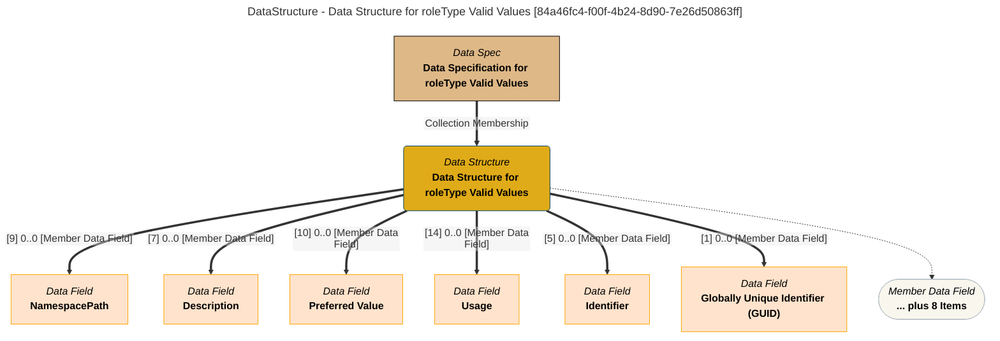

```mermaid
---
title: DataStructure - Data Structure for roleType Valid Values [84a46fc4-f00f-4b24-8d90-7e26d50863ff]
---
flowchart TD
%%{init: {"flowchart": {"htmlLabels": false}} }%%

1@{ shape: rounded, label: "*Data Structure*
**Data Structure for roleType Valid Values**"}
2@{ shape: rect, label: "*Data Spec*
**Data Specification for roleType Valid Values**"}
2==>|"Collection Membership"|1
3@{ shape: rect, label: "*Data Field*
**NamespacePath**"}
1==>|"[9] 0..0 [Member Data Field]"|3
4@{ shape: rect, label: "*Data Field*
**Description**"}
1==>|"[7] 0..0 [Member Data Field]"|4
5@{ shape: rect, label: "*Data Field*
**Preferred Value**"}
1==>|"[10] 0..0 [Member Data Field]"|5
6@{ shape: rect, label: "*Data Field*
**Usage**"}
1==>|"[14] 0..0 [Member Data Field]"|6
7@{ shape: rect, label: "*Data Field*
**Identifier**"}
1==>|"[5] 0..0 [Member Data Field]"|7
8@{ shape: rect, label: "*Data Field*
**Globally Unique Identifier (GUID)**"}
1==>|"[1] 0..0 [Member Data Field]"|8
9@{ shape: stadium, label: "*Member Data Field*
**... plus 8 Items**"}
1-.->9
style 1 color:#000000, fill:#e0ab18, stroke:#004563
style 2 color:#000000, fill:#DEB887, stroke:#000000
style 3 color:#000000, fill:#ffe3cc, stroke:#FFA500
style 4 color:#000000, fill:#ffe3cc, stroke:#FFA500
style 5 color:#000000, fill:#ffe3cc, stroke:#FFA500
style 6 color:#000000, fill:#ffe3cc, stroke:#FFA500
style 7 color:#000000, fill:#ffe3cc, stroke:#FFA500
style 8 color:#000000, fill:#ffe3cc, stroke:#FFA500
style 9 color:#000000, fill:#F9F7ED, stroke:#b7c0c7
```
> Data Structure for roleType Valid Values: The data structure lists the fields in the Valid Metadata Value Set: roleType product. (Extracted from 6.0-SNAPSHOT)
