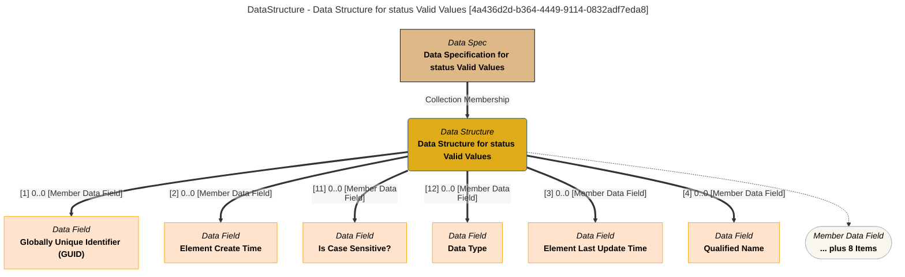

```mermaid
---
title: DataStructure - Data Structure for status Valid Values [4a436d2d-b364-4449-9114-0832adf7eda8]
---
flowchart TD
%%{init: {"flowchart": {"htmlLabels": false}} }%%

1@{ shape: rounded, label: "*Data Structure*
**Data Structure for status Valid Values**"}
2@{ shape: rect, label: "*Data Spec*
**Data Specification for status Valid Values**"}
2==>|"Collection Membership"|1
3@{ shape: rect, label: "*Data Field*
**Globally Unique Identifier (GUID)**"}
1==>|"[1] 0..0 [Member Data Field]"|3
4@{ shape: rect, label: "*Data Field*
**Element Create Time**"}
1==>|"[2] 0..0 [Member Data Field]"|4
5@{ shape: rect, label: "*Data Field*
**Is Case Sensitive?**"}
1==>|"[11] 0..0 [Member Data Field]"|5
6@{ shape: rect, label: "*Data Field*
**Data Type**"}
1==>|"[12] 0..0 [Member Data Field]"|6
7@{ shape: rect, label: "*Data Field*
**Element Last Update Time**"}
1==>|"[3] 0..0 [Member Data Field]"|7
8@{ shape: rect, label: "*Data Field*
**Qualified Name**"}
1==>|"[4] 0..0 [Member Data Field]"|8
9@{ shape: stadium, label: "*Member Data Field*
**... plus 8 Items**"}
1-.->9
style 1 color:#000000, fill:#e0ab18, stroke:#004563
style 2 color:#000000, fill:#DEB887, stroke:#000000
style 3 color:#000000, fill:#ffe3cc, stroke:#FFA500
style 4 color:#000000, fill:#ffe3cc, stroke:#FFA500
style 5 color:#000000, fill:#ffe3cc, stroke:#FFA500
style 6 color:#000000, fill:#ffe3cc, stroke:#FFA500
style 7 color:#000000, fill:#ffe3cc, stroke:#FFA500
style 8 color:#000000, fill:#ffe3cc, stroke:#FFA500
style 9 color:#000000, fill:#F9F7ED, stroke:#b7c0c7
```
> Data Structure for status Valid Values: The data structure lists the fields in the Valid Metadata Value Set: status product. (Extracted from 6.0-SNAPSHOT)
