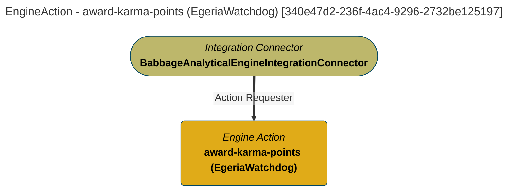

```mermaid
---
title: EngineAction - award-karma-points (EgeriaWatchdog) [340e47d2-236f-4ac4-9296-2732be125197]
---
flowchart TD
%%{init: {"flowchart": {"htmlLabels": false}} }%%

1@{ shape: rounded, label: "*Engine Action*
**award-karma-points (EgeriaWatchdog)**"}
2@{ shape: stadium, label: "*Integration Connector*
**BabbageAnalyticalEngineIntegrationConnector**"}
2==>|"Action Requester"|1
style 1 color:#000000, fill:#e0ab18, stroke:#004563
style 2 color:#000000, fill:#bdb76b, stroke:#004563
```
