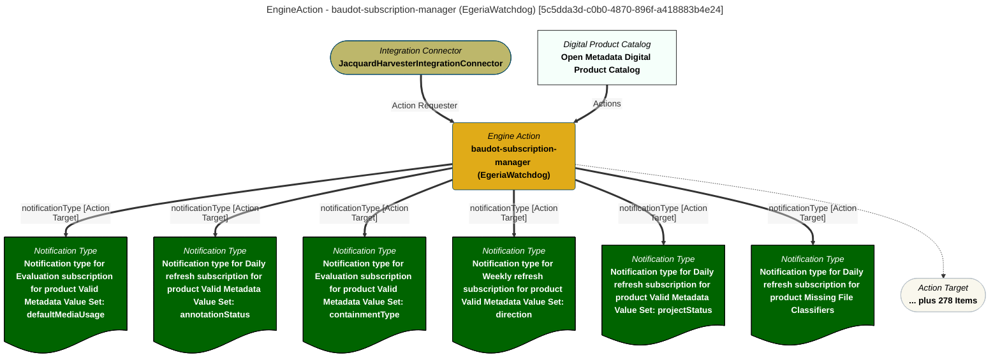

```mermaid
---
title: EngineAction - baudot-subscription-manager (EgeriaWatchdog) [5c5dda3d-c0b0-4870-896f-a418883b4e24]
---
flowchart TD
%%{init: {"flowchart": {"htmlLabels": false}} }%%

1@{ shape: rounded, label: "*Engine Action*
**baudot-subscription-manager (EgeriaWatchdog)**"}
2@{ shape: stadium, label: "*Integration Connector*
**JacquardHarvesterIntegrationConnector**"}
2==>|"Action Requester"|1
3@{ shape: rect, label: "*Digital Product Catalog*
**Open Metadata Digital Product Catalog**"}
3==>|"Actions"|1
4@{ shape: doc, label: "*Notification Type*
**Notification type for Evaluation subscription for product Valid Metadata Value Set: defaultMediaUsage**"}
1==>|"notificationType [Action Target]"|4
5@{ shape: doc, label: "*Notification Type*
**Notification type for Daily refresh subscription for product Valid Metadata Value Set: annotationStatus**"}
1==>|"notificationType [Action Target]"|5
6@{ shape: doc, label: "*Notification Type*
**Notification type for Evaluation subscription for product Valid Metadata Value Set: containmentType**"}
1==>|"notificationType [Action Target]"|6
7@{ shape: doc, label: "*Notification Type*
**Notification type for Weekly refresh subscription for product Valid Metadata Value Set: direction**"}
1==>|"notificationType [Action Target]"|7
8@{ shape: doc, label: "*Notification Type*
**Notification type for Daily refresh subscription for product Valid Metadata Value Set: projectStatus**"}
1==>|"notificationType [Action Target]"|8
9@{ shape: doc, label: "*Notification Type*
**Notification type for Daily refresh subscription for product Missing File Classifiers**"}
1==>|"notificationType [Action Target]"|9
10@{ shape: stadium, label: "*Action Target*
**... plus 278 Items**"}
1-.->10
style 1 color:#000000, fill:#e0ab18, stroke:#004563
style 2 color:#000000, fill:#bdb76b, stroke:#004563
style 3 color:#000000, fill:#f5fffa, stroke:#000000
style 4 color:#FFFFFF, fill:#006400, stroke:#000000
style 5 color:#FFFFFF, fill:#006400, stroke:#000000
style 6 color:#FFFFFF, fill:#006400, stroke:#000000
style 7 color:#FFFFFF, fill:#006400, stroke:#000000
style 8 color:#FFFFFF, fill:#006400, stroke:#000000
style 9 color:#FFFFFF, fill:#006400, stroke:#000000
style 10 color:#000000, fill:#F9F7ED, stroke:#b7c0c7
```
