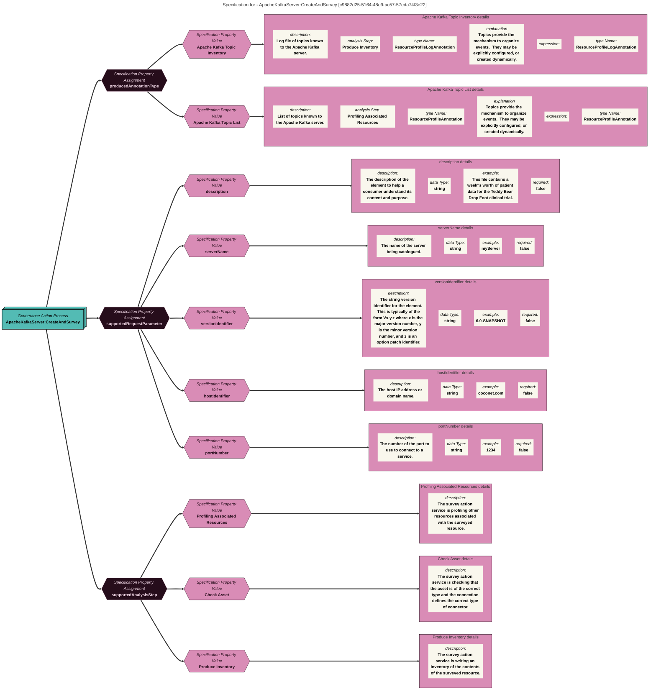

```mermaid
---
title: Specification for - ApacheKafkaServer:CreateAndSurvey [c9882d25-5164-48e9-ac57-57eda74f3e22]
---
flowchart LR
%%{init: {"flowchart": {"htmlLabels": false}} }%%

1@{ shape: processes, label: "*Governance Action Process*
**ApacheKafkaServer:CreateAndSurvey**"}
2@{ shape: hex, label: "*Specification Property Assignment*
**producedAnnotationType**"}
1==>2
3@{ shape: hex, label: "*Specification Property Value*
**Apache Kafka Topic Inventory**"}
2==>3
subgraph 4 [Apache Kafka Topic Inventory details]
5@{ shape: text, label: "*description:*
**Log file of topics known to the Apache Kafka server.**"}
6@{ shape: text, label: "*analysis Step:*
**Produce Inventory**"}
7@{ shape: text, label: "*type Name:*
**ResourceProfileLogAnnotation**"}
8@{ shape: text, label: "*explanation*
**Topics provide the mechanism to organize events.  They may be explicitly configured, or created dynamically.**"}
9@{ shape: text, label: "*expression:*
"}
10@{ shape: text, label: "*type Name:*
**ResourceProfileLogAnnotation**"}
end
3==>4
11@{ shape: hex, label: "*Specification Property Value*
**Apache Kafka Topic List**"}
2==>11
subgraph 12 [Apache Kafka Topic List details]
13@{ shape: text, label: "*description:*
**List of topics known to the Apache Kafka server.**"}
14@{ shape: text, label: "*analysis Step:*
**Profiling Associated Resources**"}
15@{ shape: text, label: "*type Name:*
**ResourceProfileAnnotation**"}
16@{ shape: text, label: "*explanation*
**Topics provide the mechanism to organize events.  They may be explicitly configured, or created dynamically.**"}
17@{ shape: text, label: "*expression:*
"}
18@{ shape: text, label: "*type Name:*
**ResourceProfileAnnotation**"}
end
11==>12
19@{ shape: hex, label: "*Specification Property Assignment*
**supportedRequestParameter**"}
1==>19
20@{ shape: hex, label: "*Specification Property Value*
**description**"}
19==>20
subgraph 21 [description details]
22@{ shape: text, label: "*description:*
**The description of the element to help a consumer understand its content and purpose.**"}
23@{ shape: text, label: "*data Type:*
**string**"}
24@{ shape: text, label: "*example:*
**This file contains a week''s worth of patient data for the Teddy Bear Drop Foot clinical trial.**"}
25@{ shape: text, label: "*required:*
**false**"}
end
20==>21
26@{ shape: hex, label: "*Specification Property Value*
**serverName**"}
19==>26
subgraph 27 [serverName details]
28@{ shape: text, label: "*description:*
**The name of the server being catalogued.**"}
29@{ shape: text, label: "*data Type:*
**string**"}
30@{ shape: text, label: "*example:*
**myServer**"}
31@{ shape: text, label: "*required:*
**false**"}
end
26==>27
32@{ shape: hex, label: "*Specification Property Value*
**versionIdentifier**"}
19==>32
subgraph 33 [versionIdentifier details]
34@{ shape: text, label: "*description:*
**The string version identifier for the element.  This is typically of the form Vx.y.z where x is the major version number, y is the minor version number, and z is an option patch identifier.**"}
35@{ shape: text, label: "*data Type:*
**string**"}
36@{ shape: text, label: "*example:*
**6.0-SNAPSHOT**"}
37@{ shape: text, label: "*required:*
**false**"}
end
32==>33
38@{ shape: hex, label: "*Specification Property Value*
**hostIdentifier**"}
19==>38
subgraph 39 [hostIdentifier details]
40@{ shape: text, label: "*description:*
**The host IP address or domain name.**"}
41@{ shape: text, label: "*data Type:*
**string**"}
42@{ shape: text, label: "*example:*
**coconet.com**"}
43@{ shape: text, label: "*required:*
**false**"}
end
38==>39
44@{ shape: hex, label: "*Specification Property Value*
**portNumber**"}
19==>44
subgraph 45 [portNumber details]
46@{ shape: text, label: "*description:*
**The number of the port to use to connect to a service.**"}
47@{ shape: text, label: "*data Type:*
**string**"}
48@{ shape: text, label: "*example:*
**1234**"}
49@{ shape: text, label: "*required:*
**false**"}
end
44==>45
50@{ shape: hex, label: "*Specification Property Assignment*
**supportedAnalysisStep**"}
1==>50
51@{ shape: hex, label: "*Specification Property Value*
**Profiling Associated Resources**"}
50==>51
subgraph 52 [Profiling Associated Resources details]
53@{ shape: text, label: "*description:*
**The survey action service is profiling other resources associated with the surveyed resource.**"}
end
51==>52
54@{ shape: hex, label: "*Specification Property Value*
**Check Asset**"}
50==>54
subgraph 55 [Check Asset details]
56@{ shape: text, label: "*description:*
**The survey action service is checking that the asset is of the correct type and the connection defines the correct type of connector.**"}
end
54==>55
57@{ shape: hex, label: "*Specification Property Value*
**Produce Inventory**"}
50==>57
subgraph 58 [Produce Inventory details]
59@{ shape: text, label: "*description:*
**The survey action service is writing an inventory of the contents of the surveyed resource.**"}
end
57==>58
style 44 color:#260d1b, fill:#d98cb6, stroke:#260d1b
style 45 color:#260d1b, fill:#d98cb6, stroke:#260d1b
style 46 color:#000000, fill:#F9F7ED, stroke:#b7c0c7
style 47 color:#000000, fill:#F9F7ED, stroke:#b7c0c7
style 48 color:#000000, fill:#F9F7ED, stroke:#b7c0c7
style 49 color:#000000, fill:#F9F7ED, stroke:#b7c0c7
style 50 color:#f2d9e7, fill:#260d1b, stroke:#f2d9e7
style 51 color:#260d1b, fill:#d98cb6, stroke:#260d1b
style 52 color:#260d1b, fill:#d98cb6, stroke:#260d1b
style 53 color:#000000, fill:#F9F7ED, stroke:#b7c0c7
style 10 color:#000000, fill:#F9F7ED, stroke:#b7c0c7
style 54 color:#260d1b, fill:#d98cb6, stroke:#260d1b
style 11 color:#260d1b, fill:#d98cb6, stroke:#260d1b
style 55 color:#260d1b, fill:#d98cb6, stroke:#260d1b
style 12 color:#260d1b, fill:#d98cb6, stroke:#260d1b
style 56 color:#000000, fill:#F9F7ED, stroke:#b7c0c7
style 13 color:#000000, fill:#F9F7ED, stroke:#b7c0c7
style 57 color:#260d1b, fill:#d98cb6, stroke:#260d1b
style 14 color:#000000, fill:#F9F7ED, stroke:#b7c0c7
style 58 color:#260d1b, fill:#d98cb6, stroke:#260d1b
style 15 color:#000000, fill:#F9F7ED, stroke:#b7c0c7
style 59 color:#000000, fill:#F9F7ED, stroke:#b7c0c7
style 16 color:#000000, fill:#F9F7ED, stroke:#b7c0c7
style 17 color:#000000, fill:#F9F7ED, stroke:#b7c0c7
style 18 color:#000000, fill:#F9F7ED, stroke:#b7c0c7
style 19 color:#f2d9e7, fill:#260d1b, stroke:#f2d9e7
style 1 color:#000000, fill:#53bbb4, stroke:#000000
style 2 color:#f2d9e7, fill:#260d1b, stroke:#f2d9e7
style 3 color:#260d1b, fill:#d98cb6, stroke:#260d1b
style 4 color:#260d1b, fill:#d98cb6, stroke:#260d1b
style 5 color:#000000, fill:#F9F7ED, stroke:#b7c0c7
style 6 color:#000000, fill:#F9F7ED, stroke:#b7c0c7
style 7 color:#000000, fill:#F9F7ED, stroke:#b7c0c7
style 8 color:#000000, fill:#F9F7ED, stroke:#b7c0c7
style 9 color:#000000, fill:#F9F7ED, stroke:#b7c0c7
style 20 color:#260d1b, fill:#d98cb6, stroke:#260d1b
style 21 color:#260d1b, fill:#d98cb6, stroke:#260d1b
style 22 color:#000000, fill:#F9F7ED, stroke:#b7c0c7
style 23 color:#000000, fill:#F9F7ED, stroke:#b7c0c7
style 24 color:#000000, fill:#F9F7ED, stroke:#b7c0c7
style 25 color:#000000, fill:#F9F7ED, stroke:#b7c0c7
style 26 color:#260d1b, fill:#d98cb6, stroke:#260d1b
style 27 color:#260d1b, fill:#d98cb6, stroke:#260d1b
style 28 color:#000000, fill:#F9F7ED, stroke:#b7c0c7
style 29 color:#000000, fill:#F9F7ED, stroke:#b7c0c7
style 30 color:#000000, fill:#F9F7ED, stroke:#b7c0c7
style 31 color:#000000, fill:#F9F7ED, stroke:#b7c0c7
style 32 color:#260d1b, fill:#d98cb6, stroke:#260d1b
style 33 color:#260d1b, fill:#d98cb6, stroke:#260d1b
style 34 color:#000000, fill:#F9F7ED, stroke:#b7c0c7
style 35 color:#000000, fill:#F9F7ED, stroke:#b7c0c7
style 36 color:#000000, fill:#F9F7ED, stroke:#b7c0c7
style 37 color:#000000, fill:#F9F7ED, stroke:#b7c0c7
style 38 color:#260d1b, fill:#d98cb6, stroke:#260d1b
style 39 color:#260d1b, fill:#d98cb6, stroke:#260d1b
style 40 color:#000000, fill:#F9F7ED, stroke:#b7c0c7
style 41 color:#000000, fill:#F9F7ED, stroke:#b7c0c7
style 42 color:#000000, fill:#F9F7ED, stroke:#b7c0c7
style 43 color:#000000, fill:#F9F7ED, stroke:#b7c0c7
```
