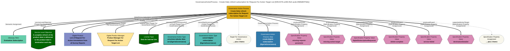

```mermaid
---
title: GovernanceActionProcess - Create Daily refresh subscription for Request For Action Target List [93f12376-a198-4fe4-aceb-8589df2f7b0e]
---
flowchart TD
%%{init: {"flowchart": {"htmlLabels": false}} }%%

1@{ shape: rounded, label: "*Governance Action Process*
**Create Daily refresh subscription for Request For Action Target List**"}
2@{ shape: rect, label: "*Digital Product*
**List of Request For Action Annotations from all Survey Reports**"}
2==>|"Create Subscription [Resource List]"|1
3@{ shape: rect, label: "*Glossary Term*
**Evaluation Subscription**"}
1==>|"Semantic Assignment"|3
4@{ shape: doc, label: "*Service Level Objective*
**A complete refresh of the product data is delivered to the product data''s destination each day**"}
1==>|"serviceLevelObjective [Target For Governance Action]"|4
1==>|"digitalSubscriptionItem [Target For Governance Action]"|2
5@{ shape: trap-t, label: "*Digital Product Manager*
**Product Manager for Request For Action Target List**"}
1==>|"digitalProductOwner [Target For Governance Action]"|5
6@{ shape: doc, label: "*License Type*
**Data for Internal Use**"}
1==>|"licenseType [Target For Governance Action]"|6
7@{ shape: tag-rect, label: "*Governance Action Type*
**provision-tabular-data-set (EgeriaGovernance)**"}
1==>|"provisioningGovernanceActionType [Target For Governance Action]"|7
8@{ shape: tag-rect, label: "*Governance Action Type*
**cancel-digital-subscription (EgeriaGovernance)**"}
1==>|"cancellingGovernanceActionType [Target For Governance Action]"|8
9@{ shape: stadium, label: "*Target For Governance Action*
**... plus 2 Items**"}
1-.->9
10@{ shape: rounded, label: "*Governance Action Process Step*
**create-digital-subscription (EgeriaGovernance)**"}
1==>|"Governance Action Process Flow"|10
11@{ shape: hex, label: "*Specification Property Value*
**missing-request-parameter**"}
1==>|"producedGuard [Specification Property Assignment]"|11
12@{ shape: hex, label: "*Specification Property Value*
**missing-action-target**"}
1==>|"producedGuard [Specification Property Assignment]"|12
13@{ shape: hex, label: "*Specification Property Value*
**digitalSubscriptionRequester**"}
1==>|"supportedActionTarget [Specification Property Assignment]"|13
14@{ shape: hex, label: "*Specification Property Value*
**delete-complete**"}
1==>|"producedGuard [Specification Property Assignment]"|14
15@{ shape: hex, label: "*Specification Property Value*
**service-failed**"}
1==>|"producedGuard [Specification Property Assignment]"|15
16@{ shape: hex, label: "*Specification Property Value*
**destinationDataSet**"}
1==>|"supportedActionTarget [Specification Property Assignment]"|16
17@{ shape: stadium, label: "*Specification Property Assignment*
**... plus 2 Items**"}
1-.->17
style 11 color:#260d1b, fill:#d98cb6, stroke:#260d1b
style 12 color:#260d1b, fill:#d98cb6, stroke:#260d1b
style 13 color:#260d1b, fill:#d98cb6, stroke:#260d1b
style 14 color:#260d1b, fill:#d98cb6, stroke:#260d1b
style 15 color:#260d1b, fill:#d98cb6, stroke:#260d1b
style 16 color:#260d1b, fill:#d98cb6, stroke:#260d1b
style 17 color:#000000, fill:#F9F7ED, stroke:#b7c0c7
style 1 color:#000000, fill:#e0ab18, stroke:#004563
style 2 color:#000000, fill:#838cc7, stroke:#3079ab
style 3 color:#000000, fill:#66cdaa, stroke:#008080
style 4 color:#FFFFFF, fill:#006400, stroke:#000000
style 5 color:#000000, fill:#FFE599, stroke:#000000
style 6 color:#FFFFFF, fill:#006400, stroke:#000000
style 7 color:#000000, fill:#53bbb4, stroke:#000000
style 8 color:#000000, fill:#53bbb4, stroke:#000000
style 9 color:#000000, fill:#F9F7ED, stroke:#b7c0c7
style 10 color:#FFFFFF, fill:#3079ab, stroke:#000000
```
