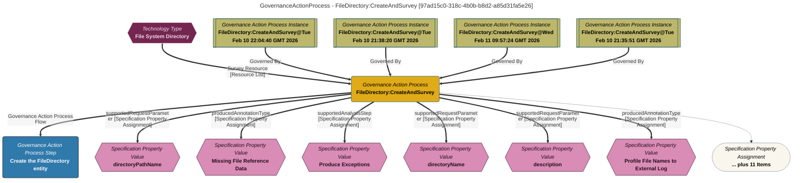

```mermaid
---
title: GovernanceActionProcess - FileDirectory:CreateAndSurvey [97ad15c0-318c-4b0b-b8d2-a85d31fa5e26]
---
flowchart TD
%%{init: {"flowchart": {"htmlLabels": false}} }%%

1@{ shape: rounded, label: "*Governance Action Process*
**FileDirectory:CreateAndSurvey**"}
2@{ shape: hex, label: "*Technology Type*
**File System Directory**"}
2==>|"Survey Resource [Resource List]"|1
3@{ shape: subproc, label: "*Governance Action Process Instance*
**FileDirectory:CreateAndSurvey@Tue Feb 10 22:04:40 GMT 2026**"}
3==>|"Governed By"|1
4@{ shape: subproc, label: "*Governance Action Process Instance*
**FileDirectory:CreateAndSurvey@Tue Feb 10 21:38:20 GMT 2026**"}
4==>|"Governed By"|1
5@{ shape: subproc, label: "*Governance Action Process Instance*
**FileDirectory:CreateAndSurvey@Wed Feb 11 09:57:24 GMT 2026**"}
5==>|"Governed By"|1
6@{ shape: subproc, label: "*Governance Action Process Instance*
**FileDirectory:CreateAndSurvey@Tue Feb 10 21:35:51 GMT 2026**"}
6==>|"Governed By"|1
7@{ shape: rounded, label: "*Governance Action Process Step*
**Create the FileDirectory entity**"}
1==>|"Governance Action Process Flow"|7
8@{ shape: hex, label: "*Specification Property Value*
**directoryPathName**"}
1==>|"supportedRequestParameter [Specification Property Assignment]"|8
9@{ shape: hex, label: "*Specification Property Value*
**Missing File Reference Data**"}
1==>|"producedAnnotationType [Specification Property Assignment]"|9
10@{ shape: hex, label: "*Specification Property Value*
**Produce Exceptions**"}
1==>|"supportedAnalysisStep [Specification Property Assignment]"|10
11@{ shape: hex, label: "*Specification Property Value*
**directoryName**"}
1==>|"supportedRequestParameter [Specification Property Assignment]"|11
12@{ shape: hex, label: "*Specification Property Value*
**description**"}
1==>|"supportedRequestParameter [Specification Property Assignment]"|12
13@{ shape: hex, label: "*Specification Property Value*
**Profile File Names to External Log**"}
1==>|"producedAnnotationType [Specification Property Assignment]"|13
14@{ shape: stadium, label: "*Specification Property Assignment*
**... plus 11 Items**"}
1-.->14
style 11 color:#260d1b, fill:#d98cb6, stroke:#260d1b
style 12 color:#260d1b, fill:#d98cb6, stroke:#260d1b
style 13 color:#260d1b, fill:#d98cb6, stroke:#260d1b
style 14 color:#000000, fill:#F9F7ED, stroke:#b7c0c7
style 1 color:#000000, fill:#e0ab18, stroke:#004563
style 2 color:#f2d9e7, fill:#732650, stroke:#f2d9e7
style 3 color:#000000, fill:#bdb76b, stroke:#004563
style 4 color:#000000, fill:#bdb76b, stroke:#004563
style 5 color:#000000, fill:#bdb76b, stroke:#004563
style 6 color:#000000, fill:#bdb76b, stroke:#004563
style 7 color:#FFFFFF, fill:#3079ab, stroke:#000000
style 8 color:#260d1b, fill:#d98cb6, stroke:#260d1b
style 9 color:#260d1b, fill:#d98cb6, stroke:#260d1b
style 10 color:#260d1b, fill:#d98cb6, stroke:#260d1b
click 1 "https://egeria-project.org/egeria-solutions/leveraging-files/overview/" "Click for more documentation" _blank
click 2 "https://egeria-project.org/types/2/0220-Files-and-Folders/" "Click for more documentation" _blank
```
