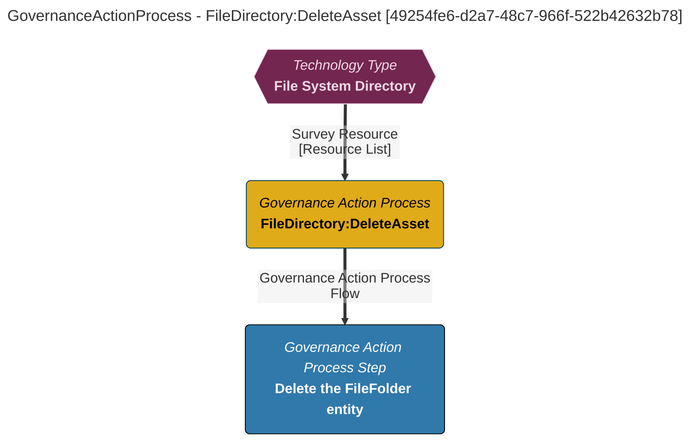

```mermaid
---
title: GovernanceActionProcess - FileDirectory:DeleteAsset [49254fe6-d2a7-48c7-966f-522b42632b78]
---
flowchart TD
%%{init: {"flowchart": {"htmlLabels": false}} }%%

1@{ shape: rounded, label: "*Governance Action Process*
**FileDirectory:DeleteAsset**"}
2@{ shape: hex, label: "*Technology Type*
**File System Directory**"}
2==>|"Survey Resource [Resource List]"|1
3@{ shape: rounded, label: "*Governance Action Process Step*
**Delete the FileFolder entity**"}
1==>|"Governance Action Process Flow"|3
style 1 color:#000000, fill:#e0ab18, stroke:#004563
style 2 color:#f2d9e7, fill:#732650, stroke:#f2d9e7
style 3 color:#FFFFFF, fill:#3079ab, stroke:#000000
click 1 "https://egeria-project.org/egeria-solutions/leveraging-files/overview/" "Click for more documentation" _blank
click 2 "https://egeria-project.org/types/2/0220-Files-and-Folders/" "Click for more documentation" _blank
```
