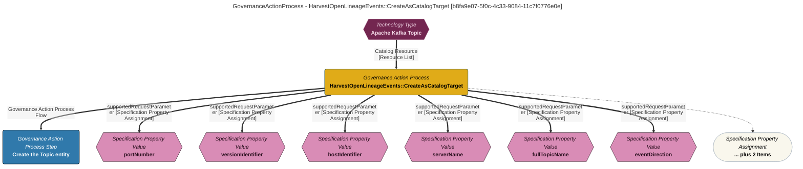

```mermaid
---
title: GovernanceActionProcess - HarvestOpenLineageEvents::CreateAsCatalogTarget [b8fa9e07-5f0c-4c33-9084-11c7f0776e0e]
---
flowchart TD
%%{init: {"flowchart": {"htmlLabels": false}} }%%

1@{ shape: rounded, label: "*Governance Action Process*
**HarvestOpenLineageEvents::CreateAsCatalogTarget**"}
2@{ shape: hex, label: "*Technology Type*
**Apache Kafka Topic**"}
2==>|"Catalog Resource [Resource List]"|1
3@{ shape: rounded, label: "*Governance Action Process Step*
**Create the Topic entity**"}
1==>|"Governance Action Process Flow"|3
4@{ shape: hex, label: "*Specification Property Value*
**portNumber**"}
1==>|"supportedRequestParameter [Specification Property Assignment]"|4
5@{ shape: hex, label: "*Specification Property Value*
**versionIdentifier**"}
1==>|"supportedRequestParameter [Specification Property Assignment]"|5
6@{ shape: hex, label: "*Specification Property Value*
**hostIdentifier**"}
1==>|"supportedRequestParameter [Specification Property Assignment]"|6
7@{ shape: hex, label: "*Specification Property Value*
**serverName**"}
1==>|"supportedRequestParameter [Specification Property Assignment]"|7
8@{ shape: hex, label: "*Specification Property Value*
**fullTopicName**"}
1==>|"supportedRequestParameter [Specification Property Assignment]"|8
9@{ shape: hex, label: "*Specification Property Value*
**eventDirection**"}
1==>|"supportedRequestParameter [Specification Property Assignment]"|9
10@{ shape: stadium, label: "*Specification Property Assignment*
**... plus 2 Items**"}
1-.->10
style 1 color:#000000, fill:#e0ab18, stroke:#004563
style 2 color:#f2d9e7, fill:#732650, stroke:#f2d9e7
style 3 color:#FFFFFF, fill:#3079ab, stroke:#000000
style 4 color:#260d1b, fill:#d98cb6, stroke:#260d1b
style 5 color:#260d1b, fill:#d98cb6, stroke:#260d1b
style 6 color:#260d1b, fill:#d98cb6, stroke:#260d1b
style 7 color:#260d1b, fill:#d98cb6, stroke:#260d1b
style 8 color:#260d1b, fill:#d98cb6, stroke:#260d1b
style 9 color:#260d1b, fill:#d98cb6, stroke:#260d1b
style 10 color:#000000, fill:#F9F7ED, stroke:#b7c0c7
click 1 "https://egeria-project.org/egeria-solutions/leveraging-open-lineage/overview/" "Click for more documentation" _blank
click 2 "https://kafka.apache.org/" "Click for more documentation" _blank
```
