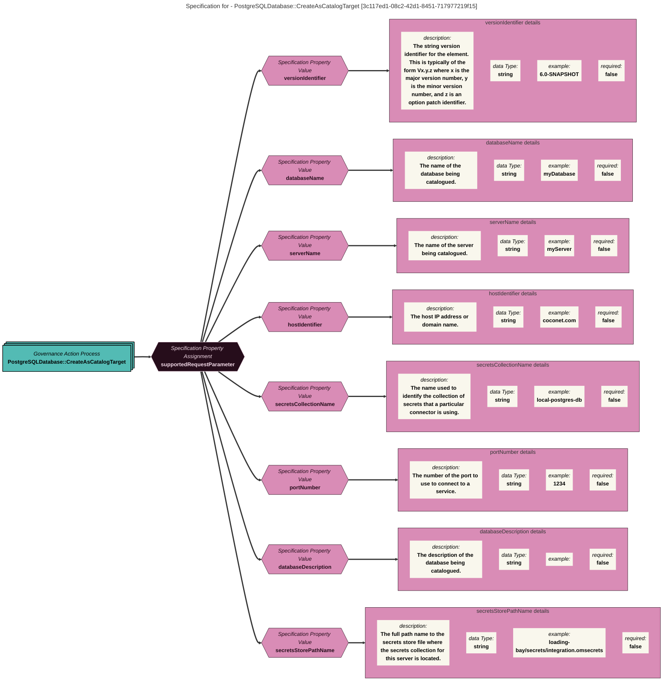

```mermaid
---
title: Specification for - PostgreSQLDatabase::CreateAsCatalogTarget [3c117ed1-08c2-42d1-8451-717977219f15]
---
flowchart LR
%%{init: {"flowchart": {"htmlLabels": false}} }%%

1@{ shape: processes, label: "*Governance Action Process*
**PostgreSQLDatabase::CreateAsCatalogTarget**"}
2@{ shape: hex, label: "*Specification Property Assignment*
**supportedRequestParameter**"}
1==>2
3@{ shape: hex, label: "*Specification Property Value*
**versionIdentifier**"}
2==>3
subgraph 4 [versionIdentifier details]
5@{ shape: text, label: "*description:*
**The string version identifier for the element.  This is typically of the form Vx.y.z where x is the major version number, y is the minor version number, and z is an option patch identifier.**"}
6@{ shape: text, label: "*data Type:*
**string**"}
7@{ shape: text, label: "*example:*
**6.0-SNAPSHOT**"}
8@{ shape: text, label: "*required:*
**false**"}
end
3==>4
9@{ shape: hex, label: "*Specification Property Value*
**databaseName**"}
2==>9
subgraph 10 [databaseName details]
11@{ shape: text, label: "*description:*
**The name of the database being catalogued.**"}
12@{ shape: text, label: "*data Type:*
**string**"}
13@{ shape: text, label: "*example:*
**myDatabase**"}
14@{ shape: text, label: "*required:*
**false**"}
end
9==>10
15@{ shape: hex, label: "*Specification Property Value*
**serverName**"}
2==>15
subgraph 16 [serverName details]
17@{ shape: text, label: "*description:*
**The name of the server being catalogued.**"}
18@{ shape: text, label: "*data Type:*
**string**"}
19@{ shape: text, label: "*example:*
**myServer**"}
20@{ shape: text, label: "*required:*
**false**"}
end
15==>16
21@{ shape: hex, label: "*Specification Property Value*
**hostIdentifier**"}
2==>21
subgraph 22 [hostIdentifier details]
23@{ shape: text, label: "*description:*
**The host IP address or domain name.**"}
24@{ shape: text, label: "*data Type:*
**string**"}
25@{ shape: text, label: "*example:*
**coconet.com**"}
26@{ shape: text, label: "*required:*
**false**"}
end
21==>22
27@{ shape: hex, label: "*Specification Property Value*
**secretsCollectionName**"}
2==>27
subgraph 28 [secretsCollectionName details]
29@{ shape: text, label: "*description:*
**The name used to identify the collection of secrets that a particular connector is using.**"}
30@{ shape: text, label: "*data Type:*
**string**"}
31@{ shape: text, label: "*example:*
**local-postgres-db**"}
32@{ shape: text, label: "*required:*
**false**"}
end
27==>28
33@{ shape: hex, label: "*Specification Property Value*
**portNumber**"}
2==>33
subgraph 34 [portNumber details]
35@{ shape: text, label: "*description:*
**The number of the port to use to connect to a service.**"}
36@{ shape: text, label: "*data Type:*
**string**"}
37@{ shape: text, label: "*example:*
**1234**"}
38@{ shape: text, label: "*required:*
**false**"}
end
33==>34
39@{ shape: hex, label: "*Specification Property Value*
**databaseDescription**"}
2==>39
subgraph 40 [databaseDescription details]
41@{ shape: text, label: "*description:*
**The description of the database being catalogued.**"}
42@{ shape: text, label: "*data Type:*
**string**"}
43@{ shape: text, label: "*example:*
"}
44@{ shape: text, label: "*required:*
**false**"}
end
39==>40
45@{ shape: hex, label: "*Specification Property Value*
**secretsStorePathName**"}
2==>45
subgraph 46 [secretsStorePathName details]
47@{ shape: text, label: "*description:*
**The full path name to the secrets store file where the secrets collection for this server is located.**"}
48@{ shape: text, label: "*data Type:*
**string**"}
49@{ shape: text, label: "*example:*
**loading-bay/secrets/integration.omsecrets**"}
50@{ shape: text, label: "*required:*
**false**"}
end
45==>46
style 44 color:#000000, fill:#F9F7ED, stroke:#b7c0c7
style 45 color:#260d1b, fill:#d98cb6, stroke:#260d1b
style 46 color:#260d1b, fill:#d98cb6, stroke:#260d1b
style 47 color:#000000, fill:#F9F7ED, stroke:#b7c0c7
style 48 color:#000000, fill:#F9F7ED, stroke:#b7c0c7
style 49 color:#000000, fill:#F9F7ED, stroke:#b7c0c7
style 50 color:#000000, fill:#F9F7ED, stroke:#b7c0c7
style 10 color:#260d1b, fill:#d98cb6, stroke:#260d1b
style 11 color:#000000, fill:#F9F7ED, stroke:#b7c0c7
style 12 color:#000000, fill:#F9F7ED, stroke:#b7c0c7
style 13 color:#000000, fill:#F9F7ED, stroke:#b7c0c7
style 14 color:#000000, fill:#F9F7ED, stroke:#b7c0c7
style 15 color:#260d1b, fill:#d98cb6, stroke:#260d1b
style 16 color:#260d1b, fill:#d98cb6, stroke:#260d1b
style 17 color:#000000, fill:#F9F7ED, stroke:#b7c0c7
style 18 color:#000000, fill:#F9F7ED, stroke:#b7c0c7
style 19 color:#000000, fill:#F9F7ED, stroke:#b7c0c7
style 1 color:#000000, fill:#53bbb4, stroke:#000000
style 2 color:#f2d9e7, fill:#260d1b, stroke:#f2d9e7
style 3 color:#260d1b, fill:#d98cb6, stroke:#260d1b
style 4 color:#260d1b, fill:#d98cb6, stroke:#260d1b
style 5 color:#000000, fill:#F9F7ED, stroke:#b7c0c7
style 6 color:#000000, fill:#F9F7ED, stroke:#b7c0c7
style 7 color:#000000, fill:#F9F7ED, stroke:#b7c0c7
style 8 color:#000000, fill:#F9F7ED, stroke:#b7c0c7
style 9 color:#260d1b, fill:#d98cb6, stroke:#260d1b
style 20 color:#000000, fill:#F9F7ED, stroke:#b7c0c7
style 21 color:#260d1b, fill:#d98cb6, stroke:#260d1b
style 22 color:#260d1b, fill:#d98cb6, stroke:#260d1b
style 23 color:#000000, fill:#F9F7ED, stroke:#b7c0c7
style 24 color:#000000, fill:#F9F7ED, stroke:#b7c0c7
style 25 color:#000000, fill:#F9F7ED, stroke:#b7c0c7
style 26 color:#000000, fill:#F9F7ED, stroke:#b7c0c7
style 27 color:#260d1b, fill:#d98cb6, stroke:#260d1b
style 28 color:#260d1b, fill:#d98cb6, stroke:#260d1b
style 29 color:#000000, fill:#F9F7ED, stroke:#b7c0c7
style 30 color:#000000, fill:#F9F7ED, stroke:#b7c0c7
style 31 color:#000000, fill:#F9F7ED, stroke:#b7c0c7
style 32 color:#000000, fill:#F9F7ED, stroke:#b7c0c7
style 33 color:#260d1b, fill:#d98cb6, stroke:#260d1b
style 34 color:#260d1b, fill:#d98cb6, stroke:#260d1b
style 35 color:#000000, fill:#F9F7ED, stroke:#b7c0c7
style 36 color:#000000, fill:#F9F7ED, stroke:#b7c0c7
style 37 color:#000000, fill:#F9F7ED, stroke:#b7c0c7
style 38 color:#000000, fill:#F9F7ED, stroke:#b7c0c7
style 39 color:#260d1b, fill:#d98cb6, stroke:#260d1b
style 40 color:#260d1b, fill:#d98cb6, stroke:#260d1b
style 41 color:#000000, fill:#F9F7ED, stroke:#b7c0c7
style 42 color:#000000, fill:#F9F7ED, stroke:#b7c0c7
style 43 color:#000000, fill:#F9F7ED, stroke:#b7c0c7
```
