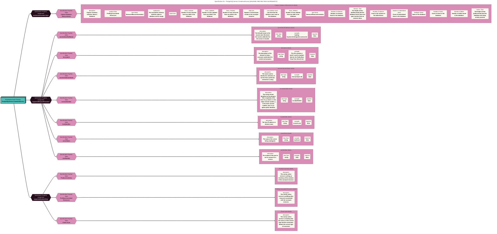

```mermaid
---
title: Specification for - PostgreSQLServer:CreateAndSurvey [626a45d8-196b-49e2-9615-5ec991665072]
---
flowchart LR
%%{init: {"flowchart": {"htmlLabels": false}} }%%

1@{ shape: processes, label: "*Governance Action Process*
**PostgreSQLServer:CreateAndSurvey**"}
2@{ shape: hex, label: "*Specification Property Assignment*
**producedAnnotationType**"}
1==>2
3@{ shape: hex, label: "*Specification Property Value*
**Capture Database Measurements**"}
2==>3
subgraph 4 [Capture Database Measurements details]
5@{ shape: text, label: "*description:*
**Capture summary statistics about a database.**"}
6@{ shape: text, label: "*analysis Step:*
**Profiling Associated Resources**"}
7@{ shape: text, label: "*type Name:*
**ResourceMeasureAnnotation**"}
8@{ shape: text, label: "*explanation*
**This annotation retrieves statistics about a database and its usage.**"}
9@{ shape: text, label: "*expression:*
"}
10@{ shape: text, label: "*Rows  Inserted:*
**Number of rows inserted from any table in the database.**"}
11@{ shape: text, label: "*Rows  Updated:*
**Number of rows updated from any table in the database.**"}
12@{ shape: text, label: "*Rows  Fetched:*
**Number of rows retrieved from any table in the database.**"}
13@{ shape: text, label: "*Data size:*
**Number of stored bytes of data in the surveyed resource.**"}
14@{ shape: text, label: "*Last statistics reset:*
**Last time that the statistics were reset in the database.**"}
15@{ shape: text, label: "*Rows  Deleted:*
**Number of rows deleted from any table in the database.**"}
16@{ shape: text, label: "*type Name:*
**ResourceMeasureAnnotation**"}
17@{ shape: text, label: "*Number of schemas:*
**Number of schemas found in the database.**"}
18@{ shape: text, label: "*Session  Time:*
**The length of time (milliseconds) that the database had at least one open session from an external client.**"}
19@{ shape: text, label: "*Number of columns:*
**Count of all columns in the tables/views.**"}
20@{ shape: text, label: "*Number of materialized views:*
**Count of materialized views in the database.**"}
21@{ shape: text, label: "*Database  Name:*
**Name of the database**"}
22@{ shape: text, label: "*Number of views:*
**Count of views in the database.**"}
23@{ shape: text, label: "*Number of tables:*
**Number of tables found in the database.**"}
24@{ shape: text, label: "*Active  Time:*
**The length of time (milliseconds) that the database was being actively queried.**"}
end
3==>4
25@{ shape: hex, label: "*Specification Property Assignment*
**supportedRequestParameter**"}
1==>25
26@{ shape: hex, label: "*Specification Property Value*
**secretsStorePathName**"}
25==>26
subgraph 27 [secretsStorePathName details]
28@{ shape: text, label: "*description:*
**The full path name to the secrets store file where the secrets collection for this server is located.**"}
29@{ shape: text, label: "*data Type:*
**string**"}
30@{ shape: text, label: "*example:*
**loading-bay/secrets/integration.omsecrets**"}
31@{ shape: text, label: "*required:*
**false**"}
end
26==>27
32@{ shape: hex, label: "*Specification Property Value*
**description**"}
25==>32
subgraph 33 [description details]
34@{ shape: text, label: "*description:*
**The description of the element to help a consumer understand its content and purpose.**"}
35@{ shape: text, label: "*data Type:*
**string**"}
36@{ shape: text, label: "*example:*
**This file contains a week''s worth of patient data for the Teddy Bear Drop Foot clinical trial.**"}
37@{ shape: text, label: "*required:*
**false**"}
end
32==>33
38@{ shape: hex, label: "*Specification Property Value*
**secretsCollectionName**"}
25==>38
subgraph 39 [secretsCollectionName details]
40@{ shape: text, label: "*description:*
**The name used to identify the collection of secrets that a particular connector is using.**"}
41@{ shape: text, label: "*data Type:*
**string**"}
42@{ shape: text, label: "*example:*
**local-postgres-db**"}
43@{ shape: text, label: "*required:*
**false**"}
end
38==>39
44@{ shape: hex, label: "*Specification Property Value*
**versionIdentifier**"}
25==>44
subgraph 45 [versionIdentifier details]
46@{ shape: text, label: "*description:*
**The string version identifier for the element.  This is typically of the form Vx.y.z where x is the major version number, y is the minor version number, and z is an option patch identifier.**"}
47@{ shape: text, label: "*data Type:*
**string**"}
48@{ shape: text, label: "*example:*
**6.0-SNAPSHOT**"}
49@{ shape: text, label: "*required:*
**false**"}
end
44==>45
50@{ shape: hex, label: "*Specification Property Value*
**hostIdentifier**"}
25==>50
subgraph 51 [hostIdentifier details]
52@{ shape: text, label: "*description:*
**The host IP address or domain name.**"}
53@{ shape: text, label: "*data Type:*
**string**"}
54@{ shape: text, label: "*example:*
**coconet.com**"}
55@{ shape: text, label: "*required:*
**false**"}
end
50==>51
56@{ shape: hex, label: "*Specification Property Value*
**serverName**"}
25==>56
subgraph 57 [serverName details]
58@{ shape: text, label: "*description:*
**The name of the server being catalogued.**"}
59@{ shape: text, label: "*data Type:*
**string**"}
60@{ shape: text, label: "*example:*
**myServer**"}
61@{ shape: text, label: "*required:*
**false**"}
end
56==>57
62@{ shape: hex, label: "*Specification Property Value*
**portNumber**"}
25==>62
subgraph 63 [portNumber details]
64@{ shape: text, label: "*description:*
**The number of the port to use to connect to a service.**"}
65@{ shape: text, label: "*data Type:*
**string**"}
66@{ shape: text, label: "*example:*
**1234**"}
67@{ shape: text, label: "*required:*
**false**"}
end
62==>63
68@{ shape: hex, label: "*Specification Property Assignment*
**supportedAnalysisStep**"}
1==>68
69@{ shape: hex, label: "*Specification Property Value*
**Produce Inventory**"}
68==>69
subgraph 70 [Produce Inventory details]
71@{ shape: text, label: "*description:*
**The survey action service is writing an inventory of the contents of the surveyed resource.**"}
end
69==>70
72@{ shape: hex, label: "*Specification Property Value*
**Profiling Associated Resources**"}
68==>72
subgraph 73 [Profiling Associated Resources details]
74@{ shape: text, label: "*description:*
**The survey action service is profiling other resources associated with the surveyed resource.**"}
end
72==>73
75@{ shape: hex, label: "*Specification Property Value*
**Check Asset**"}
68==>75
subgraph 76 [Check Asset details]
77@{ shape: text, label: "*description:*
**The survey action service is checking that the asset is of the correct type and the connection defines the correct type of connector.**"}
end
75==>76
style 44 color:#260d1b, fill:#d98cb6, stroke:#260d1b
style 45 color:#260d1b, fill:#d98cb6, stroke:#260d1b
style 46 color:#000000, fill:#F9F7ED, stroke:#b7c0c7
style 47 color:#000000, fill:#F9F7ED, stroke:#b7c0c7
style 48 color:#000000, fill:#F9F7ED, stroke:#b7c0c7
style 49 color:#000000, fill:#F9F7ED, stroke:#b7c0c7
style 50 color:#260d1b, fill:#d98cb6, stroke:#260d1b
style 51 color:#260d1b, fill:#d98cb6, stroke:#260d1b
style 52 color:#000000, fill:#F9F7ED, stroke:#b7c0c7
style 53 color:#000000, fill:#F9F7ED, stroke:#b7c0c7
style 10 color:#000000, fill:#F9F7ED, stroke:#b7c0c7
style 54 color:#000000, fill:#F9F7ED, stroke:#b7c0c7
style 11 color:#000000, fill:#F9F7ED, stroke:#b7c0c7
style 55 color:#000000, fill:#F9F7ED, stroke:#b7c0c7
style 12 color:#000000, fill:#F9F7ED, stroke:#b7c0c7
style 56 color:#260d1b, fill:#d98cb6, stroke:#260d1b
style 13 color:#000000, fill:#F9F7ED, stroke:#b7c0c7
style 57 color:#260d1b, fill:#d98cb6, stroke:#260d1b
style 14 color:#000000, fill:#F9F7ED, stroke:#b7c0c7
style 58 color:#000000, fill:#F9F7ED, stroke:#b7c0c7
style 15 color:#000000, fill:#F9F7ED, stroke:#b7c0c7
style 59 color:#000000, fill:#F9F7ED, stroke:#b7c0c7
style 16 color:#000000, fill:#F9F7ED, stroke:#b7c0c7
style 17 color:#000000, fill:#F9F7ED, stroke:#b7c0c7
style 18 color:#000000, fill:#F9F7ED, stroke:#b7c0c7
style 19 color:#000000, fill:#F9F7ED, stroke:#b7c0c7
style 1 color:#000000, fill:#53bbb4, stroke:#000000
style 2 color:#f2d9e7, fill:#260d1b, stroke:#f2d9e7
style 3 color:#260d1b, fill:#d98cb6, stroke:#260d1b
style 4 color:#260d1b, fill:#d98cb6, stroke:#260d1b
style 5 color:#000000, fill:#F9F7ED, stroke:#b7c0c7
style 6 color:#000000, fill:#F9F7ED, stroke:#b7c0c7
style 7 color:#000000, fill:#F9F7ED, stroke:#b7c0c7
style 8 color:#000000, fill:#F9F7ED, stroke:#b7c0c7
style 9 color:#000000, fill:#F9F7ED, stroke:#b7c0c7
style 60 color:#000000, fill:#F9F7ED, stroke:#b7c0c7
style 61 color:#000000, fill:#F9F7ED, stroke:#b7c0c7
style 62 color:#260d1b, fill:#d98cb6, stroke:#260d1b
style 63 color:#260d1b, fill:#d98cb6, stroke:#260d1b
style 20 color:#000000, fill:#F9F7ED, stroke:#b7c0c7
style 64 color:#000000, fill:#F9F7ED, stroke:#b7c0c7
style 21 color:#000000, fill:#F9F7ED, stroke:#b7c0c7
style 65 color:#000000, fill:#F9F7ED, stroke:#b7c0c7
style 22 color:#000000, fill:#F9F7ED, stroke:#b7c0c7
style 66 color:#000000, fill:#F9F7ED, stroke:#b7c0c7
style 23 color:#000000, fill:#F9F7ED, stroke:#b7c0c7
style 67 color:#000000, fill:#F9F7ED, stroke:#b7c0c7
style 24 color:#000000, fill:#F9F7ED, stroke:#b7c0c7
style 68 color:#f2d9e7, fill:#260d1b, stroke:#f2d9e7
style 25 color:#f2d9e7, fill:#260d1b, stroke:#f2d9e7
style 69 color:#260d1b, fill:#d98cb6, stroke:#260d1b
style 26 color:#260d1b, fill:#d98cb6, stroke:#260d1b
style 27 color:#260d1b, fill:#d98cb6, stroke:#260d1b
style 28 color:#000000, fill:#F9F7ED, stroke:#b7c0c7
style 29 color:#000000, fill:#F9F7ED, stroke:#b7c0c7
style 70 color:#260d1b, fill:#d98cb6, stroke:#260d1b
style 71 color:#000000, fill:#F9F7ED, stroke:#b7c0c7
style 72 color:#260d1b, fill:#d98cb6, stroke:#260d1b
style 73 color:#260d1b, fill:#d98cb6, stroke:#260d1b
style 30 color:#000000, fill:#F9F7ED, stroke:#b7c0c7
style 74 color:#000000, fill:#F9F7ED, stroke:#b7c0c7
style 31 color:#000000, fill:#F9F7ED, stroke:#b7c0c7
style 75 color:#260d1b, fill:#d98cb6, stroke:#260d1b
style 32 color:#260d1b, fill:#d98cb6, stroke:#260d1b
style 76 color:#260d1b, fill:#d98cb6, stroke:#260d1b
style 33 color:#260d1b, fill:#d98cb6, stroke:#260d1b
style 77 color:#000000, fill:#F9F7ED, stroke:#b7c0c7
style 34 color:#000000, fill:#F9F7ED, stroke:#b7c0c7
style 35 color:#000000, fill:#F9F7ED, stroke:#b7c0c7
style 36 color:#000000, fill:#F9F7ED, stroke:#b7c0c7
style 37 color:#000000, fill:#F9F7ED, stroke:#b7c0c7
style 38 color:#260d1b, fill:#d98cb6, stroke:#260d1b
style 39 color:#260d1b, fill:#d98cb6, stroke:#260d1b
style 40 color:#000000, fill:#F9F7ED, stroke:#b7c0c7
style 41 color:#000000, fill:#F9F7ED, stroke:#b7c0c7
style 42 color:#000000, fill:#F9F7ED, stroke:#b7c0c7
style 43 color:#000000, fill:#F9F7ED, stroke:#b7c0c7
```
