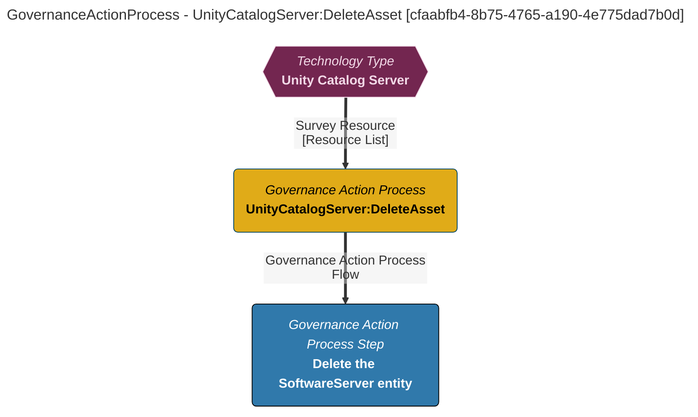

```mermaid
---
title: GovernanceActionProcess - UnityCatalogServer:DeleteAsset [cfaabfb4-8b75-4765-a190-4e775dad7b0d]
---
flowchart TD
%%{init: {"flowchart": {"htmlLabels": false}} }%%

1@{ shape: rounded, label: "*Governance Action Process*
**UnityCatalogServer:DeleteAsset**"}
2@{ shape: hex, label: "*Technology Type*
**Unity Catalog Server**"}
2==>|"Survey Resource [Resource List]"|1
3@{ shape: rounded, label: "*Governance Action Process Step*
**Delete the SoftwareServer entity**"}
1==>|"Governance Action Process Flow"|3
style 1 color:#000000, fill:#e0ab18, stroke:#004563
style 2 color:#f2d9e7, fill:#732650, stroke:#f2d9e7
style 3 color:#FFFFFF, fill:#3079ab, stroke:#000000
click 1 "https://egeria-project.org/egeria-solutions/leveraging-unity-catalog/overview/" "Click for more documentation" _blank
click 2 "https://github.com/unitycatalog/unitycatalog" "Click for more documentation" _blank
```
