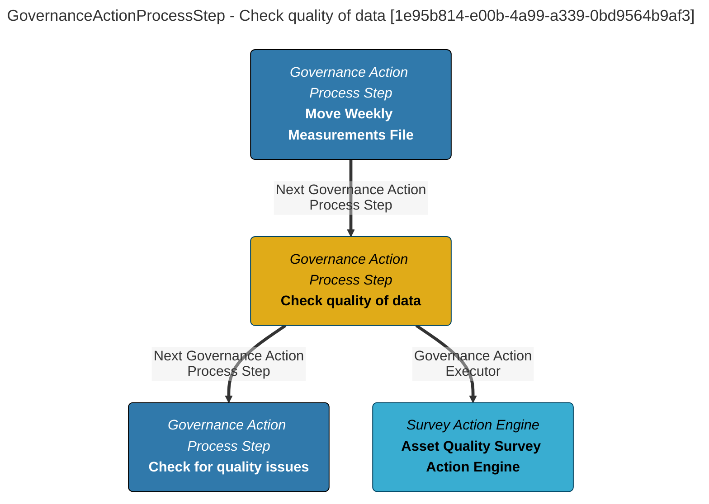

```mermaid
---
title: GovernanceActionProcessStep - Check quality of data [1e95b814-e00b-4a99-a339-0bd9564b9af3]
---
flowchart TD
%%{init: {"flowchart": {"htmlLabels": false}} }%%

1@{ shape: rounded, label: "*Governance Action Process Step*
**Check quality of data**"}
2@{ shape: rounded, label: "*Governance Action Process Step*
**Move Weekly Measurements File**"}
2==>|"Next Governance Action Process Step"|1
3@{ shape: rounded, label: "*Governance Action Process Step*
**Check for quality issues**"}
1==>|"Next Governance Action Process Step"|3
4@{ shape: rounded, label: "*Survey Action Engine*
**Asset Quality Survey Action Engine**"}
1==>|"Governance Action Executor"|4
style 1 color:#000000, fill:#e0ab18, stroke:#004563
style 2 color:#FFFFFF, fill:#3079ab, stroke:#000000
style 3 color:#FFFFFF, fill:#3079ab, stroke:#000000
style 4 color:#000000, fill:#39add1, stroke:#004563
```
