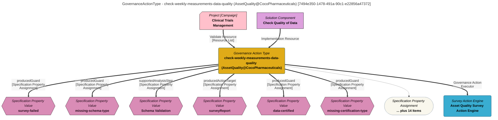

```mermaid
---
title: GovernanceActionType - check-weekly-measurements-data-quality (AssetQuality@CocoPharmaceuticals) [7494e350-1478-491a-90c1-e22856a47372]
---
flowchart TD
%%{init: {"flowchart": {"htmlLabels": false}} }%%

1@{ shape: rounded, label: "*Governance Action Type*
**check-weekly-measurements-data-quality (AssetQuality@CocoPharmaceuticals)**"}
2@{ shape: notch-rect, label: "*Project [Campaign]*
**Clinical Trials Management**"}
2==>|"Validate Resource [Resource List]"|1
3@{ shape: hex, label: "*Specification Property Value*
**survey-failed**"}
1==>|"producedGuard [Specification Property Assignment]"|3
4@{ shape: hex, label: "*Specification Property Value*
**missing-schema-type**"}
1==>|"producedGuard [Specification Property Assignment]"|4
5@{ shape: hex, label: "*Specification Property Value*
**Schema Validation**"}
1==>|"supportedAnalysisStep [Specification Property Assignment]"|5
6@{ shape: hex, label: "*Specification Property Value*
**surveyReport**"}
1==>|"producedActionTarget [Specification Property Assignment]"|6
7@{ shape: hex, label: "*Specification Property Value*
**data-certified**"}
1==>|"producedGuard [Specification Property Assignment]"|7
8@{ shape: hex, label: "*Specification Property Value*
**missing-certification-type**"}
1==>|"producedGuard [Specification Property Assignment]"|8
9@{ shape: stadium, label: "*Specification Property Assignment*
**... plus 14 Items**"}
1-.->9
10@{ shape: rect, label: "*Solution Component*
**Check Quality of Data**"}
10==>|"Implementation Resource"|1
11@{ shape: rounded, label: "*Survey Action Engine*
**Asset Quality Survey Action Engine**"}
1==>|"Governance Action Executor"|11
style 11 color:#000000, fill:#39add1, stroke:#004563
style 1 color:#000000, fill:#e0ab18, stroke:#004563
style 2 color:#000000, fill:#FFC0CB, stroke:#000000
style 3 color:#260d1b, fill:#d98cb6, stroke:#260d1b
style 4 color:#260d1b, fill:#d98cb6, stroke:#260d1b
style 5 color:#260d1b, fill:#d98cb6, stroke:#260d1b
style 6 color:#260d1b, fill:#d98cb6, stroke:#260d1b
style 7 color:#260d1b, fill:#d98cb6, stroke:#260d1b
style 8 color:#260d1b, fill:#d98cb6, stroke:#260d1b
style 9 color:#000000, fill:#F9F7ED, stroke:#b7c0c7
style 10 color:#000000, fill:#DDA0DD, stroke:#000000
```
