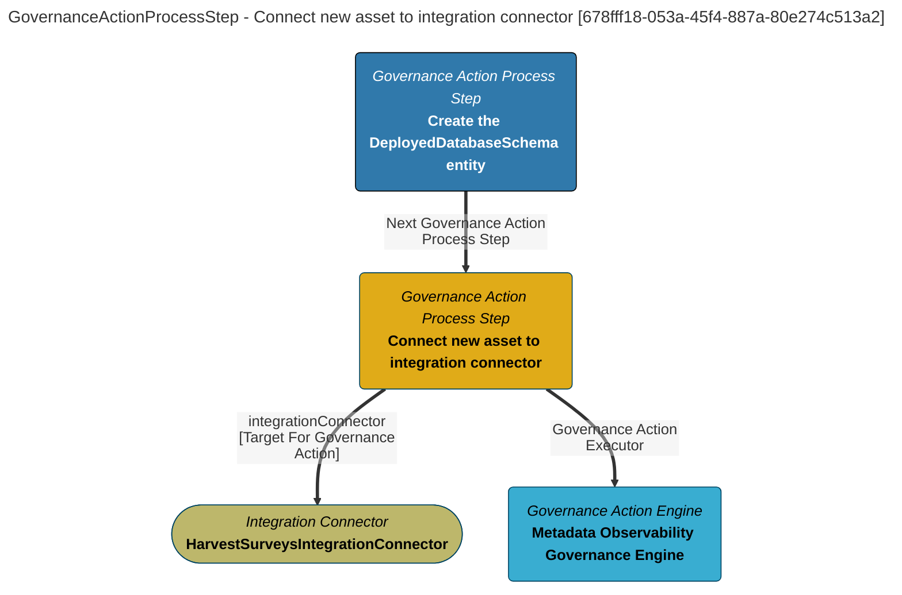

```mermaid
---
title: GovernanceActionProcessStep - Connect new asset to integration connector [678fff18-053a-45f4-887a-80e274c513a2]
---
flowchart TD
%%{init: {"flowchart": {"htmlLabels": false}} }%%

1@{ shape: rounded, label: "*Governance Action Process Step*
**Connect new asset to integration connector**"}
2@{ shape: stadium, label: "*Integration Connector*
**HarvestSurveysIntegrationConnector**"}
1==>|"integrationConnector [Target For Governance Action]"|2
3@{ shape: rounded, label: "*Governance Action Process Step*
**Create the DeployedDatabaseSchema entity**"}
3==>|"Next Governance Action Process Step"|1
4@{ shape: rounded, label: "*Governance Action Engine*
**Metadata Observability Governance Engine**"}
1==>|"Governance Action Executor"|4
style 1 color:#000000, fill:#e0ab18, stroke:#004563
style 2 color:#000000, fill:#BDB76B, stroke:#004563
style 3 color:#FFFFFF, fill:#3079ab, stroke:#000000
style 4 color:#000000, fill:#39add1, stroke:#004563
```
