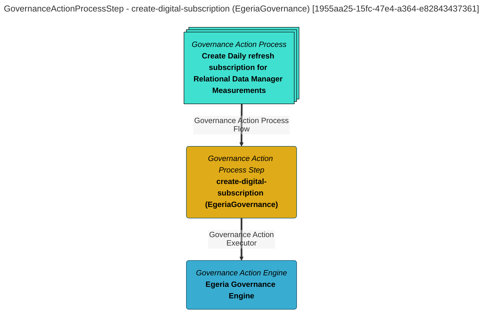

```mermaid
---
title: GovernanceActionProcessStep - create-digital-subscription (EgeriaGovernance) [1955aa25-15fc-47e4-a364-e82843437361]
---
flowchart TD
%%{init: {"flowchart": {"htmlLabels": false}} }%%

1@{ shape: rounded, label: "*Governance Action Process Step*
**create-digital-subscription (EgeriaGovernance)**"}
2@{ shape: processes, label: "*Governance Action Process*
**Create Daily refresh subscription for Relational Data Manager Measurements**"}
2==>|"Governance Action Process Flow"|1
3@{ shape: rounded, label: "*Governance Action Engine*
**Egeria Governance Engine**"}
1==>|"Governance Action Executor"|3
style 1 color:#000000, fill:#e0ab18, stroke:#004563
style 2 color:#000000, fill:#40E0D0, stroke:#000000
style 3 color:#000000, fill:#39add1, stroke:#004563
```
