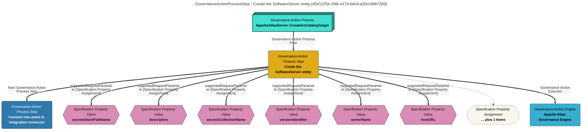

```mermaid
---
title: GovernanceActionProcessStep - Create the SoftwareServer entity [4541225e-2f4b-4174-b4c9-a20cc99b7283]
---
flowchart TD
%%{init: {"flowchart": {"htmlLabels": false}} }%%

1@{ shape: rounded, label: "*Governance Action Process Step*
**Create the SoftwareServer entity**"}
2@{ shape: processes, label: "*Governance Action Process*
**ApacheAtlasServer::CreateAsCatalogTarget**"}
2==>|"Governance Action Process Flow"|1
3@{ shape: rounded, label: "*Governance Action Process Step*
**Connect new asset to integration connector**"}
1==>|"Next Governance Action Process Step"|3
4@{ shape: hex, label: "*Specification Property Value*
**secretsStorePathName**"}
1==>|"supportedRequestParameter [Specification Property Assignment]"|4
5@{ shape: hex, label: "*Specification Property Value*
**description**"}
1==>|"supportedRequestParameter [Specification Property Assignment]"|5
6@{ shape: hex, label: "*Specification Property Value*
**secretsCollectionName**"}
1==>|"supportedRequestParameter [Specification Property Assignment]"|6
7@{ shape: hex, label: "*Specification Property Value*
**versionIdentifier**"}
1==>|"supportedRequestParameter [Specification Property Assignment]"|7
8@{ shape: hex, label: "*Specification Property Value*
**serverName**"}
1==>|"supportedRequestParameter [Specification Property Assignment]"|8
9@{ shape: hex, label: "*Specification Property Value*
**hostURL**"}
1==>|"supportedRequestParameter [Specification Property Assignment]"|9
10@{ shape: stadium, label: "*Specification Property Assignment*
**... plus 1 Items**"}
1-.->10
11@{ shape: rounded, label: "*Governance Action Engine*
**Apache Atlas Governance Engine**"}
1==>|"Governance Action Executor"|11
style 11 color:#000000, fill:#39add1, stroke:#004563
style 1 color:#000000, fill:#e0ab18, stroke:#004563
style 2 color:#000000, fill:#40E0D0, stroke:#000000
style 3 color:#FFFFFF, fill:#3079ab, stroke:#000000
style 4 color:#260d1b, fill:#d98cb6, stroke:#260d1b
style 5 color:#260d1b, fill:#d98cb6, stroke:#260d1b
style 6 color:#260d1b, fill:#d98cb6, stroke:#260d1b
style 7 color:#260d1b, fill:#d98cb6, stroke:#260d1b
style 8 color:#260d1b, fill:#d98cb6, stroke:#260d1b
style 9 color:#260d1b, fill:#d98cb6, stroke:#260d1b
style 10 color:#000000, fill:#F9F7ED, stroke:#b7c0c7
click 2 "https://egeria-project.org/egeria-solutions/leveraging-apache-atlas/overview/" "Click for more documentation" _blank
```
