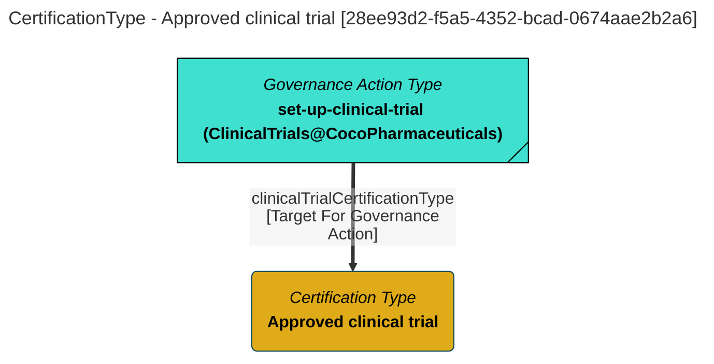

```mermaid
---
title: CertificationType - Approved clinical trial [28ee93d2-f5a5-4352-bcad-0674aae2b2a6]
---
flowchart TD
%%{init: {"flowchart": {"htmlLabels": false}} }%%

1@{ shape: rounded, label: "*Certification Type*
**Approved clinical trial**"}
2@{ shape: tag-rect, label: "*Governance Action Type*
**set-up-clinical-trial (ClinicalTrials@CocoPharmaceuticals)**"}
2==>|"clinicalTrialCertificationType [Target For Governance Action]"|1
style 1 color:#000000, fill:#e0ab18, stroke:#004563
style 2 color:#000000, fill:#40E0D0, stroke:#000000
```
