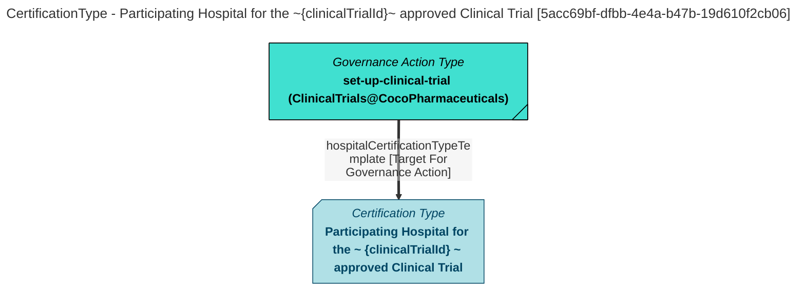

```mermaid
---
title: CertificationType - Participating Hospital for the ~{clinicalTrialId}~ approved Clinical Trial [5acc69bf-dfbb-4e4a-b47b-19d610f2cb06]
---
flowchart TD
%%{init: {"flowchart": {"htmlLabels": false}} }%%

1@{ shape: card, label: "*Certification Type*
**Participating Hospital for the ~ {clinicalTrialId} ~ approved Clinical Trial**"}
2@{ shape: tag-rect, label: "*Governance Action Type*
**set-up-clinical-trial (ClinicalTrials@CocoPharmaceuticals)**"}
2==>|"hospitalCertificationTypeTemplate [Target For Governance Action]"|1
style 1 color:#004563, fill:#b0e0e6, stroke:#004563
style 2 color:#000000, fill:#40E0D0, stroke:#000000
```
