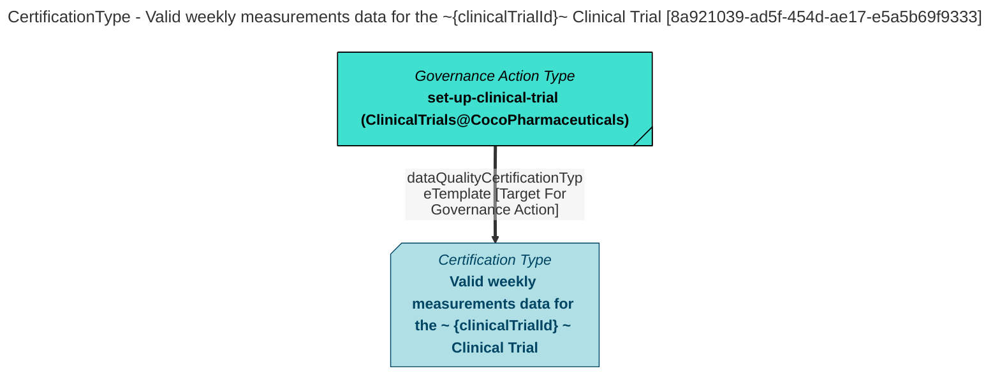

```mermaid
---
title: CertificationType - Valid weekly measurements data for the ~{clinicalTrialId}~ Clinical Trial [8a921039-ad5f-454d-ae17-e5a5b69f9333]
---
flowchart TD
%%{init: {"flowchart": {"htmlLabels": false}} }%%

1@{ shape: card, label: "*Certification Type*
**Valid weekly measurements data for the ~ {clinicalTrialId} ~ Clinical Trial**"}
2@{ shape: tag-rect, label: "*Governance Action Type*
**set-up-clinical-trial (ClinicalTrials@CocoPharmaceuticals)**"}
2==>|"dataQualityCertificationTypeTemplate [Target For Governance Action]"|1
style 1 color:#004563, fill:#b0e0e6, stroke:#004563
style 2 color:#000000, fill:#40E0D0, stroke:#000000
```
