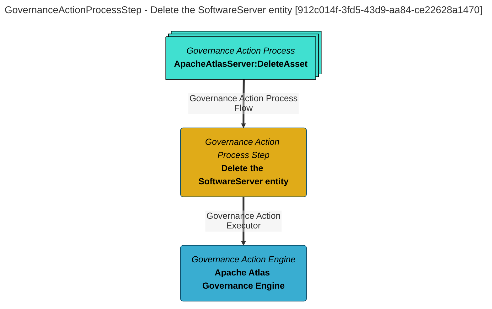

```mermaid
---
title: GovernanceActionProcessStep - Delete the SoftwareServer entity [912c014f-3fd5-43d9-aa84-ce22628a1470]
---
flowchart TD
%%{init: {"flowchart": {"htmlLabels": false}} }%%

1@{ shape: rounded, label: "*Governance Action Process Step*
**Delete the SoftwareServer entity**"}
2@{ shape: processes, label: "*Governance Action Process*
**ApacheAtlasServer:DeleteAsset**"}
2==>|"Governance Action Process Flow"|1
3@{ shape: rounded, label: "*Governance Action Engine*
**Apache Atlas Governance Engine**"}
1==>|"Governance Action Executor"|3
style 1 color:#000000, fill:#e0ab18, stroke:#004563
style 2 color:#000000, fill:#40E0D0, stroke:#000000
style 3 color:#000000, fill:#39add1, stroke:#004563
click 2 "https://egeria-project.org/egeria-solutions/leveraging-apache-atlas/overview/" "Click for more documentation" _blank
```
