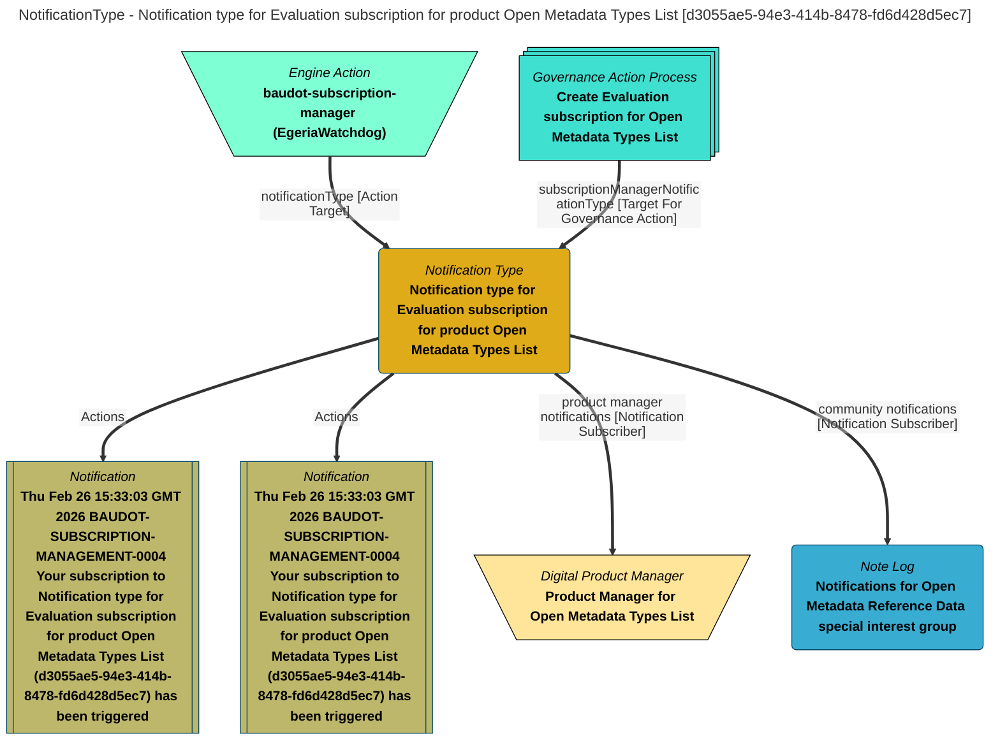

```mermaid
---
title: NotificationType - Notification type for Evaluation subscription for product Open Metadata Types List [d3055ae5-94e3-414b-8478-fd6d428d5ec7]
---
flowchart TD
%%{init: {"flowchart": {"htmlLabels": false}} }%%

1@{ shape: rounded, label: "*Notification Type*
**Notification type for Evaluation subscription for product Open Metadata Types List**"}
2@{ shape: subproc, label: "*Notification*
**Thu Feb 26 15:33:03 GMT 2026 BAUDOT-SUBSCRIPTION-MANAGEMENT-0004 Your subscription to Notification type for Evaluation subscription for product Open Metadata Types List (d3055ae5-94e3-414b-8478-fd6d428d5ec7) has been triggered**"}
1==>|"Actions"|2
3@{ shape: subproc, label: "*Notification*
**Thu Feb 26 15:33:03 GMT 2026 BAUDOT-SUBSCRIPTION-MANAGEMENT-0004 Your subscription to Notification type for Evaluation subscription for product Open Metadata Types List (d3055ae5-94e3-414b-8478-fd6d428d5ec7) has been triggered**"}
1==>|"Actions"|3
4@{ shape: trap-t, label: "*Engine Action*
**baudot-subscription-manager (EgeriaWatchdog)**"}
4==>|"notificationType [Action Target]"|1
5@{ shape: trap-t, label: "*Digital Product Manager*
**Product Manager for Open Metadata Types List**"}
1==>|"product manager notifications [Notification Subscriber]"|5
6@{ shape: rounded, label: "*Note Log*
**Notifications for Open Metadata Reference Data special interest group**"}
1==>|"community notifications [Notification Subscriber]"|6
7@{ shape: processes, label: "*Governance Action Process*
**Create Evaluation subscription for Open Metadata Types List**"}
7==>|"subscriptionManagerNotificationType [Target For Governance Action]"|1
style 1 color:#000000, fill:#e0ab18, stroke:#004563
style 2 color:#000000, fill:#BDB76B, stroke:#004563
style 3 color:#000000, fill:#BDB76B, stroke:#004563
style 4 color:#000000, fill:#7fffd4, stroke:#000000
style 5 color:#000000, fill:#FFE599, stroke:#000000
style 6 color:#000000, fill:#39add1, stroke:#004563
style 7 color:#000000, fill:#40E0D0, stroke:#000000
```
