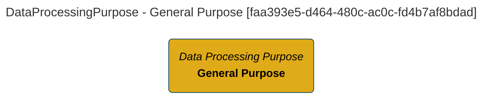

```mermaid
---
title: DataProcessingPurpose - General Purpose [faa393e5-d464-480c-ac0c-fd4b7af8bdad]
---
flowchart TD
%%{init: {"flowchart": {"htmlLabels": false}} }%%

1@{ shape: rounded, label: "*Data Processing Purpose*
**General Purpose**"}
style 1 color:#000000, fill:#e0ab18, stroke:#004563
```
