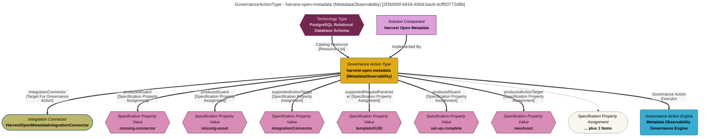

```mermaid
---
title: GovernanceActionType - harvest-open-metadata (MetadataObservability) [2f3b500f-b918-400d-bacb-dcff50772d9b]
---
flowchart TD
%%{init: {"flowchart": {"htmlLabels": false}} }%%

1@{ shape: rounded, label: "*Governance Action Type*
**harvest-open-metadata (MetadataObservability)**"}
2@{ shape: hex, label: "*Technology Type*
**PostgreSQL Relational Database Schema**"}
2==>|"Catalog Resource [Resource List]"|1
3@{ shape: stadium, label: "*Integration Connector*
**HarvestOpenMetadataIntegrationConnector**"}
1==>|"integrationConnector [Target For Governance Action]"|3
4@{ shape: hex, label: "*Specification Property Value*
**missing-connector**"}
1==>|"producedGuard [Specification Property Assignment]"|4
5@{ shape: hex, label: "*Specification Property Value*
**missing-asset**"}
1==>|"producedGuard [Specification Property Assignment]"|5
6@{ shape: hex, label: "*Specification Property Value*
**integrationConnector**"}
1==>|"supportedActionTarget [Specification Property Assignment]"|6
7@{ shape: hex, label: "*Specification Property Value*
**templateGUID**"}
1==>|"supportedRequestParameter [Specification Property Assignment]"|7
8@{ shape: hex, label: "*Specification Property Value*
**set-up-complete**"}
1==>|"producedGuard [Specification Property Assignment]"|8
9@{ shape: hex, label: "*Specification Property Value*
**newAsset**"}
1==>|"producedActionTarget [Specification Property Assignment]"|9
10@{ shape: stadium, label: "*Specification Property Assignment*
**... plus 1 Items**"}
1-.->10
11@{ shape: rect, label: "*Solution Component*
**Harvest Open Metadata**"}
11==>|"Implemented By"|1
12@{ shape: rounded, label: "*Governance Action Engine*
**Metadata Observability Governance Engine**"}
1==>|"Governance Action Executor"|12
style 11 color:#000000, fill:#DDA0DD, stroke:#000000
style 1 color:#000000, fill:#e0ab18, stroke:#004563
style 12 color:#000000, fill:#39add1, stroke:#004563
style 2 color:#f2d9e7, fill:#732650, stroke:#f2d9e7
style 3 color:#000000, fill:#BDB76B, stroke:#004563
style 4 color:#260d1b, fill:#d98cb6, stroke:#260d1b
style 5 color:#260d1b, fill:#d98cb6, stroke:#260d1b
style 6 color:#260d1b, fill:#d98cb6, stroke:#260d1b
style 7 color:#260d1b, fill:#d98cb6, stroke:#260d1b
style 8 color:#260d1b, fill:#d98cb6, stroke:#260d1b
style 9 color:#260d1b, fill:#d98cb6, stroke:#260d1b
style 10 color:#000000, fill:#F9F7ED, stroke:#b7c0c7
click 11 "https://egeria-project.org/concepts/governance-action-type/" "Click for more documentation" _blank
click 2 "https://www.postgresql.org/" "Click for more documentation" _blank
```
