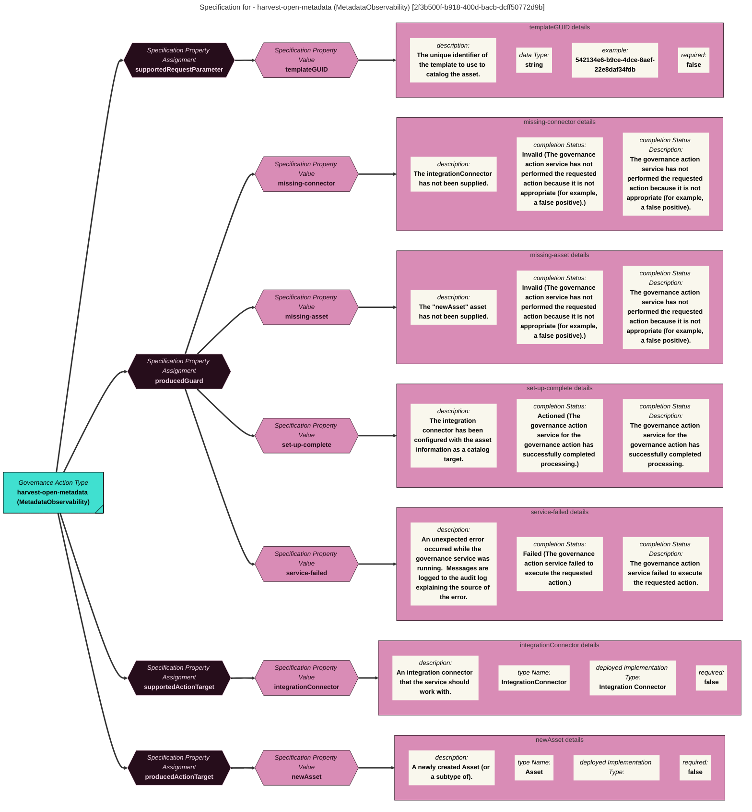

```mermaid
---
title: Specification for - harvest-open-metadata (MetadataObservability) [2f3b500f-b918-400d-bacb-dcff50772d9b]
---
flowchart LR
%%{init: {"flowchart": {"htmlLabels": false}} }%%

1@{ shape: tag-rect, label: "*Governance Action Type*
**harvest-open-metadata (MetadataObservability)**"}
2@{ shape: hex, label: "*Specification Property Assignment*
**supportedRequestParameter**"}
1==>2
3@{ shape: hex, label: "*Specification Property Value*
**templateGUID**"}
2==>3
subgraph 4 [templateGUID details]
5@{ shape: text, label: "*description:*
**The unique identifier of the template to use to catalog the asset.**"}
6@{ shape: text, label: "*data Type:*
**string**"}
7@{ shape: text, label: "*example:*
**542134e6-b9ce-4dce-8aef-22e8daf34fdb**"}
8@{ shape: text, label: "*required:*
**false**"}
end
3==>4
9@{ shape: hex, label: "*Specification Property Assignment*
**producedGuard**"}
1==>9
10@{ shape: hex, label: "*Specification Property Value*
**missing-connector**"}
9==>10
subgraph 11 [missing-connector details]
12@{ shape: text, label: "*description:*
**The integrationConnector has not been supplied.**"}
13@{ shape: text, label: "*completion Status:*
**Invalid (The governance action service has not performed the requested action because it is not appropriate (for example, a false positive).)**"}
14@{ shape: text, label: "*completion Status Description:*
**The governance action service has not performed the requested action because it is not appropriate (for example, a false positive).**"}
end
10==>11
15@{ shape: hex, label: "*Specification Property Value*
**missing-asset**"}
9==>15
subgraph 16 [missing-asset details]
17@{ shape: text, label: "*description:*
**The ''newAsset'' asset has not been supplied.**"}
18@{ shape: text, label: "*completion Status:*
**Invalid (The governance action service has not performed the requested action because it is not appropriate (for example, a false positive).)**"}
19@{ shape: text, label: "*completion Status Description:*
**The governance action service has not performed the requested action because it is not appropriate (for example, a false positive).**"}
end
15==>16
20@{ shape: hex, label: "*Specification Property Value*
**set-up-complete**"}
9==>20
subgraph 21 [set-up-complete details]
22@{ shape: text, label: "*description:*
**The integration connector has been configured with the asset information as a catalog target.**"}
23@{ shape: text, label: "*completion Status:*
**Actioned (The governance action service for the governance action has successfully completed processing.)**"}
24@{ shape: text, label: "*completion Status Description:*
**The governance action service for the governance action has successfully completed processing.**"}
end
20==>21
25@{ shape: hex, label: "*Specification Property Value*
**service-failed**"}
9==>25
subgraph 26 [service-failed details]
27@{ shape: text, label: "*description:*
**An unexpected error occurred while the governance service was running.  Messages are logged to the audit log explaining the source of the error.**"}
28@{ shape: text, label: "*completion Status:*
**Failed (The governance action service failed to execute the requested action.)**"}
29@{ shape: text, label: "*completion Status Description:*
**The governance action service failed to execute the requested action.**"}
end
25==>26
30@{ shape: hex, label: "*Specification Property Assignment*
**supportedActionTarget**"}
1==>30
31@{ shape: hex, label: "*Specification Property Value*
**integrationConnector**"}
30==>31
subgraph 32 [integrationConnector details]
33@{ shape: text, label: "*description:*
**An integration connector that the service should work with.**"}
34@{ shape: text, label: "*type Name:*
**IntegrationConnector**"}
35@{ shape: text, label: "*deployed Implementation Type:*
**Integration Connector**"}
36@{ shape: text, label: "*required:*
**false**"}
end
31==>32
37@{ shape: hex, label: "*Specification Property Assignment*
**producedActionTarget**"}
1==>37
38@{ shape: hex, label: "*Specification Property Value*
**newAsset**"}
37==>38
subgraph 39 [newAsset details]
40@{ shape: text, label: "*description:*
**A newly created Asset (or a subtype of).**"}
41@{ shape: text, label: "*type Name:*
**Asset**"}
42@{ shape: text, label: "*deployed Implementation Type:*
"}
43@{ shape: text, label: "*required:*
**false**"}
end
38==>39
style 22 color:#000000, fill:#F9F7ED, stroke:#b7c0c7
style 23 color:#000000, fill:#F9F7ED, stroke:#b7c0c7
style 24 color:#000000, fill:#F9F7ED, stroke:#b7c0c7
style 25 color:#260d1b, fill:#d98cb6, stroke:#260d1b
style 26 color:#260d1b, fill:#d98cb6, stroke:#260d1b
style 27 color:#000000, fill:#F9F7ED, stroke:#b7c0c7
style 28 color:#000000, fill:#F9F7ED, stroke:#b7c0c7
style 29 color:#000000, fill:#F9F7ED, stroke:#b7c0c7
style 30 color:#f2d9e7, fill:#260d1b, stroke:#f2d9e7
style 31 color:#260d1b, fill:#d98cb6, stroke:#260d1b
style 10 color:#260d1b, fill:#d98cb6, stroke:#260d1b
style 32 color:#260d1b, fill:#d98cb6, stroke:#260d1b
style 11 color:#260d1b, fill:#d98cb6, stroke:#260d1b
style 33 color:#000000, fill:#F9F7ED, stroke:#b7c0c7
style 12 color:#000000, fill:#F9F7ED, stroke:#b7c0c7
style 34 color:#000000, fill:#F9F7ED, stroke:#b7c0c7
style 13 color:#000000, fill:#F9F7ED, stroke:#b7c0c7
style 35 color:#000000, fill:#F9F7ED, stroke:#b7c0c7
style 14 color:#000000, fill:#F9F7ED, stroke:#b7c0c7
style 36 color:#000000, fill:#F9F7ED, stroke:#b7c0c7
style 15 color:#260d1b, fill:#d98cb6, stroke:#260d1b
style 37 color:#f2d9e7, fill:#260d1b, stroke:#f2d9e7
style 16 color:#260d1b, fill:#d98cb6, stroke:#260d1b
style 38 color:#260d1b, fill:#d98cb6, stroke:#260d1b
style 17 color:#000000, fill:#F9F7ED, stroke:#b7c0c7
style 39 color:#260d1b, fill:#d98cb6, stroke:#260d1b
style 18 color:#000000, fill:#F9F7ED, stroke:#b7c0c7
style 19 color:#000000, fill:#F9F7ED, stroke:#b7c0c7
style 1 color:#000000, fill:#40E0D0, stroke:#000000
style 2 color:#f2d9e7, fill:#260d1b, stroke:#f2d9e7
style 3 color:#260d1b, fill:#d98cb6, stroke:#260d1b
style 4 color:#260d1b, fill:#d98cb6, stroke:#260d1b
style 5 color:#000000, fill:#F9F7ED, stroke:#b7c0c7
style 6 color:#000000, fill:#F9F7ED, stroke:#b7c0c7
style 7 color:#000000, fill:#F9F7ED, stroke:#b7c0c7
style 8 color:#000000, fill:#F9F7ED, stroke:#b7c0c7
style 9 color:#f2d9e7, fill:#260d1b, stroke:#f2d9e7
style 40 color:#000000, fill:#F9F7ED, stroke:#b7c0c7
style 41 color:#000000, fill:#F9F7ED, stroke:#b7c0c7
style 20 color:#260d1b, fill:#d98cb6, stroke:#260d1b
style 42 color:#000000, fill:#F9F7ED, stroke:#b7c0c7
style 21 color:#260d1b, fill:#d98cb6, stroke:#260d1b
style 43 color:#000000, fill:#F9F7ED, stroke:#b7c0c7
```
