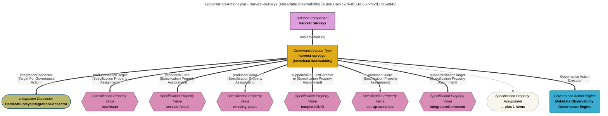

```mermaid
---
title: GovernanceActionType - harvest-surveys (MetadataObservability) [e3ea80ac-728f-4b33-8557-f92d17a6ad49]
---
flowchart TD
%%{init: {"flowchart": {"htmlLabels": false}} }%%

1@{ shape: rounded, label: "*Governance Action Type*
**harvest-surveys (MetadataObservability)**"}
2@{ shape: stadium, label: "*Integration Connector*
**HarvestSurveysIntegrationConnector**"}
1==>|"integrationConnector [Target For Governance Action]"|2
3@{ shape: hex, label: "*Specification Property Value*
**newAsset**"}
1==>|"producedActionTarget [Specification Property Assignment]"|3
4@{ shape: hex, label: "*Specification Property Value*
**service-failed**"}
1==>|"producedGuard [Specification Property Assignment]"|4
5@{ shape: hex, label: "*Specification Property Value*
**missing-asset**"}
1==>|"producedGuard [Specification Property Assignment]"|5
6@{ shape: hex, label: "*Specification Property Value*
**templateGUID**"}
1==>|"supportedRequestParameter [Specification Property Assignment]"|6
7@{ shape: hex, label: "*Specification Property Value*
**set-up-complete**"}
1==>|"producedGuard [Specification Property Assignment]"|7
8@{ shape: hex, label: "*Specification Property Value*
**integrationConnector**"}
1==>|"supportedActionTarget [Specification Property Assignment]"|8
9@{ shape: stadium, label: "*Specification Property Assignment*
**... plus 1 Items**"}
1-.->9
10@{ shape: rect, label: "*Solution Component*
**Harvest Surveys**"}
10==>|"Implemented By"|1
11@{ shape: rounded, label: "*Governance Action Engine*
**Metadata Observability Governance Engine**"}
1==>|"Governance Action Executor"|11
style 11 color:#000000, fill:#39add1, stroke:#004563
style 1 color:#000000, fill:#e0ab18, stroke:#004563
style 2 color:#000000, fill:#BDB76B, stroke:#004563
style 3 color:#260d1b, fill:#d98cb6, stroke:#260d1b
style 4 color:#260d1b, fill:#d98cb6, stroke:#260d1b
style 5 color:#260d1b, fill:#d98cb6, stroke:#260d1b
style 6 color:#260d1b, fill:#d98cb6, stroke:#260d1b
style 7 color:#260d1b, fill:#d98cb6, stroke:#260d1b
style 8 color:#260d1b, fill:#d98cb6, stroke:#260d1b
style 9 color:#000000, fill:#F9F7ED, stroke:#b7c0c7
style 10 color:#000000, fill:#DDA0DD, stroke:#000000
click 10 "https://egeria-project.org/concepts/governance-action-type/" "Click for more documentation" _blank
```
