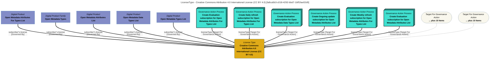

```mermaid
---
title: LicenseType - Creative Commons Attribution 4.0 International License (CC BY 4.0) [fa8ca5b3-c018-4292-bbd7-1bff1fae02d9]
---
flowchart TD
%%{init: {"flowchart": {"htmlLabels": false}} }%%

1@{ shape: rounded, label: "*License Type*
**Creative Commons Attribution 4.0 International License (CC BY 4.0)**"}
2@{ shape: rect, label: "*Digital Product*
**Open Metadata Attributes For Types List**"}
2==>|"subscriber''s license [Governed By]"|1
3@{ shape: rect, label: "*Digital Product Family*
**Open Metadata Types**"}
3==>|"subscriber''s license [Governed By]"|1
4@{ shape: rect, label: "*Digital Product*
**Open Metadata Attributes List**"}
4==>|"subscriber''s license [Governed By]"|1
5@{ shape: rect, label: "*Digital Product*
**Open Metadata Data Types List**"}
5==>|"subscriber''s license [Governed By]"|1
6@{ shape: rect, label: "*Digital Product*
**Open Metadata Types List**"}
6==>|"subscriber''s license [Governed By]"|1
7@{ shape: processes, label: "*Governance Action Process*
**Create Evaluation subscription for Open Metadata Attributes For Types List**"}
7==>|"licenseType [Target For Governance Action]"|1
8@{ shape: processes, label: "*Governance Action Process*
**Create Daily refresh subscription for Open Metadata Attributes For Types List**"}
8==>|"licenseType [Target For Governance Action]"|1
9@{ shape: processes, label: "*Governance Action Process*
**Create Evaluation subscription for Open Metadata Data Types List**"}
9==>|"licenseType [Target For Governance Action]"|1
10@{ shape: processes, label: "*Governance Action Process*
**Create Ongoing update subscription for Open Metadata Attributes List**"}
10==>|"licenseType [Target For Governance Action]"|1
11@{ shape: processes, label: "*Governance Action Process*
**Create Weekly refresh subscription for Open Metadata Attributes For Types List**"}
11==>|"licenseType [Target For Governance Action]"|1
12@{ shape: processes, label: "*Governance Action Process*
**Create Evaluation subscription for Open Metadata Attributes List**"}
12==>|"licenseType [Target For Governance Action]"|1
13@{ shape: stadium, label: "*Target For Governance Action*
**... plus 10 Items**"}
13-.->1
14@{ shape: stadium, label: "*Target For Governance Action*
**... plus 10 Items**"}
14-.->1
style 11 color:#000000, fill:#40E0D0, stroke:#000000
style 12 color:#000000, fill:#40E0D0, stroke:#000000
style 13 color:#000000, fill:#F9F7ED, stroke:#b7c0c7
style 14 color:#000000, fill:#F9F7ED, stroke:#b7c0c7
style 1 color:#000000, fill:#e0ab18, stroke:#004563
style 2 color:#000000, fill:#838cc7, stroke:#3079ab
style 3 color:#000000, fill:#838cc7, stroke:#3079ab
style 4 color:#000000, fill:#838cc7, stroke:#3079ab
style 5 color:#000000, fill:#838cc7, stroke:#3079ab
style 6 color:#000000, fill:#838cc7, stroke:#3079ab
style 7 color:#000000, fill:#40E0D0, stroke:#000000
style 8 color:#000000, fill:#40E0D0, stroke:#000000
style 9 color:#000000, fill:#40E0D0, stroke:#000000
style 10 color:#000000, fill:#40E0D0, stroke:#000000
```
